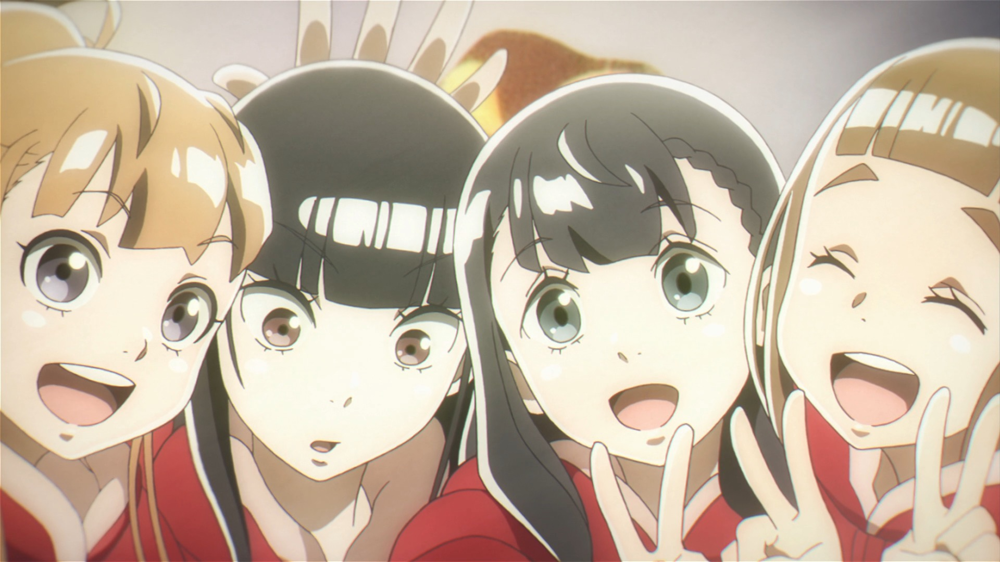

<link href="https://cdnjs.cloudflare.com/ajax/libs/lightbox2/2.8.2/css/lightbox.min.css" rel="stylesheet" property="stylesheet"/>

                                          

Click on the image above to start the carousel of the anime I was able to enjoy that aired this year...

