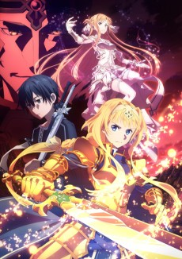
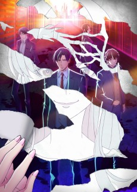

### [Boku no Hero Academia 4](https://anilist.co/anime/104276)

 

BONES

> The villain world teeters on the brink of war now that All For One is out of the picture. Shigaraki of the League of Villains squares off with Overhaul of the yakuza, vying for total control of the shadows. Meanwhile, Deku gets tangled in another dangerous internship as he struggles to keep pace with his upperclassman—Mirio.&lt;br&gt;&lt;br&gt;(Source: Crunchyroll)

### [Sword Art Online: Alicization - War of Underworld](https://anilist.co/anime/108759)

 

A-1 Pictures, Aniplex

> Despite their recent victory against Quinella, Kirito and Alice find themselves in another dangerous situation. The Ocean Turtle, the complex in which resides the machinery that sustains Underworld, is under attack by an unknown enemy, leading to Kirito being thrown into a comatose state. At the same time, in Underworld, forces from the Dark Territory are starting to move to invade the Human Empire.

### [Nanatsu no Taizai: Kamigami no Gekirin](https://anilist.co/anime/108928)

 

Studio DEEN, Marvy Jack, TV Tokyo

> The third season of &lt;i&gt;Nanatsu no Taizai&lt;/i&gt;.

### [Shinchou Yuusha: Kono Yuusha ga Ore TUEEE Kuse ni Shinchou Sugiru](https://anilist.co/anime/105156)

 

White Fox

> The goddess Rista summons a hero to help her hard mode video game-like world. The hero, Seiya, is exceptional in every way, but he is incredibly cautious to the point of buying three sets of armor (one to wear, a spare, and a spare for the spare) and going full power against weak slimes (just in case). &lt;br/&gt; &lt;br /&gt; &lt;br /&gt;

### [Shokugeki no Souma: Shin no Sara](https://anilist.co/anime/109963)

 

J.C. Staff

> The fourth season of &lt;i&gt;Shokugeki no Souma&lt;/i&gt;.

### [Ore wo Suki nano wa Omae dake ka yo](https://anilist.co/anime/104464)

 

CONNECT

> Amatsuyu &quot;Joro&quot; Kisaragi finds himself in a rather delightful situation, two lovely girls asked him out on a date in the same week. Little does he know he&#x27;s not the actual target of their love, instead, he ends up as a love consultant forced to juggle a web of relationships more complex than initially thought. &lt;br/&gt;

### [Assassins Pride](https://anilist.co/anime/104722)

 

EMT Squared

> The series takes place in a world where only those from noble families have the mana to be able to fight against monsters. Kufa is a noble born to a duke&#x27;s family who is sent to tutor a young woman named Melida. If it turns out that Melida has no talent with mana, Kufa is secretly instructed to assassinate her.

### [BEASTARS](https://anilist.co/anime/107660)

 

Orange

> In a world populated by anthropomorphic animals, herbivores and carnivores coexist with each other. For the adolescents of Cherryton Academy, school life is filled with hope, romance, distrust, and uneasiness.&lt;br&gt;&lt;br&gt;&lt;br/&gt;The main character is Legoshi the wolf, a member of the drama club. Despite his menacing appearance, he has a very gentle heart. Throughout most of his life, he has always been an object of fear and hatred by other animals, and he’s been quite accustomed to that lifestyle. But soon, he finds himself becoming more involved with his fellow classmates who have their own share of insecurities and finds his life in school changing slowly.&lt;br&gt;&lt;br&gt;
(Source: moetron)

### [PSYCHO-PASS 3](https://anilist.co/anime/108307)

 

Production I.G

> &quot;Justice&quot; opens up a new world. In the near future, the Sybil System, a surveillance network that quantifies human souls, maintains public order. In a changing world, detectives with Dominators, guns that measure &quot;Crime Coefficients,&quot; pursue &quot;latent criminals&quot; before they commit crimes. The third series of PSYCHO-PASS follows two inspectors seeking the truth: Arata Shindo and Kei Mikhail Ignatov.&lt;br&gt;&lt;br&gt;(Source: Amazon)

### [No Guns Life](https://anilist.co/anime/108478)

 

MADHOUSE, EGG FIRM

> After the war, there are many &quot;Extends&quot; in the city, people whose bodies were modified to make them into dangerous weapons. Inui Juuzou is one of them, and he has no memories of his life and body before his head was transformed into a gun. Strangely enough, his head-gun is designed so that only someone behind him can pull the trigger. Juuzou makes a living by taking on cases involving Extends in the city, and he is assisted by Mary, an intelligent young woman that he has taken under his protection.&lt;br&gt;&lt;br&gt;&lt;br/&gt;
(Source: MangaUpdates)

### [Fate/Grand Order: Zettai Majuu Sensen Babylonia](https://anilist.co/anime/103275)

 

CloverWorks, Aniplex

> Following the success in the Camelot Singularity, Ritsuka Fujimaru and Mash Kyrielight are assigned to the last Singularity in the Grand Order initiative. In Ancient Babylonia, 2600 BCE, they embark on a mission to secure humanity&#x27;s survival. Upon arrival, they learn that three gods have threatened Uruk, the Babylonian city ruled by King Gilgamesh. Ritsuka and Mash must work together to fend off the invasion of mysterious beasts in Uruk under Gilgamesh&#x27;s orders while investigating the true nature of the three goddesses&#x27; actions against humanity; but unknown to Ritsuka, an ancient entity is slowly rising from its slumber.&lt;br/&gt;&lt;br&gt;&lt;br&gt;
The anime adapts the Seventh Singularity from the Fate/Grand Order game 

### [Choujin Koukousei-tachi wa Isekai demo Yoyuu de Ikinuku you desu!](https://anilist.co/anime/108388)

 

project No.9, Pony Canyon, Dream Shift

> Seven Japanese high school prodigies have taken the world by storm, exercising their mind-blowing abilities in everything from politics to entertainment. But when their plane crashes one day, these geniuses awaken to find themselves in a different realm -one that&#x27;s home to magic and beast folk! While such strange new surroundings might throw an average person for a loop, these prodigies take their situation in stride...and then some! With the greatest minds and talents known to Earth, this dream team is about to turn the other world on its head!&lt;br/&gt;
(Source: Yen Press)

### [Boku-tachi wa Benkyou ga Dekinai!](https://anilist.co/anime/110229)

 

Studio Silver, Arvo Animation

> &lt;i&gt;Second season of BOKUBEN.&lt;/i&gt;&lt;br&gt;&lt;br&gt;To get a scholarship, Nariyuki becomes a reluctant tutor to three unteachable girls. He must quickly make an art-lover adore mathematics, turn a literary genius into a bonafide scientist, and transform a top-tier athlete into a passing student.&lt;br&gt;&lt;br&gt;(Source: HIDIVE)

### [Hataage! Kemono Michi](https://anilist.co/anime/107339)

 

ENGI, AT-X, Nippon Columbia, Kadokawa Media House

> The story follows masked wrestler Genzou Shibata, who likes all kinds of animals and creatures. One day he is summoned to another world, where a princess asks him to help kill magical beasts, but he gets mad and puts her in a German suplex. Instead, he begins life as a pet shop owner in the other world.&lt;br&gt;&lt;br&gt;&lt;br/&gt;
(Source: Anime News Network)

### [Mairimashita! Iruma-kun](https://anilist.co/anime/107693)

 

Bandai Namco Pictures, NHK Enterprises

> Suzuki Iruma has just been abandoned and sold to a demon by his irresponsible parents! Surprisingly, the next thing he knows he&#x27;s living with the demon who has adopted him as his new grandson, and has been transferred into a school in the demon world where his new &quot;demon&quot; grandfather works as the principal. Thus begins the cowardly Iruma-kun&#x27;s extraordinary school life among the otherworldly as he faces his true self, takes on challenges, and rises to become someone great...

### [Azur Lane](https://anilist.co/anime/104159)

 

Bibury

> Anime based on the mobile game Azur Lane.

### [Babylon](https://anilist.co/anime/101349)

 

Twin Engine, Revoroot

> The suspense story centers around Zen Seizaki, a prosecutor with the Tokyo District Public Prosecutors&#x27; Office. While investigating illegal acts by a certain pharmaceutical company, Seizaki stumbles across a conspiracy over an election for an autonomous &quot;new zone&quot; established in western Tokyo.&lt;br&gt;&lt;br&gt;&lt;br/&gt;
(Source: Anime News Network)

### [Watashi, Nouryoku wa Heikinchi de tte Itta yo ne!](https://anilist.co/anime/101227)

 

project No.9

> When she turns ten years old, Adele von Ascham is hit with a horrible headache–and memories of her previous life as an eighteen-year-old Japanese girl named Kurihara Misato. That life changed abruptly, however, when Misato died trying to aid a little girl and met god. During that meeting, she made an odd request and asked for average abilities in her next life. But few things–especially wishes–ever go quite as planned.&lt;br&gt;&lt;br&gt;&lt;br/&gt;
(Source: Seven Seas Entertainment)

### [Ahiru no Sora](https://anilist.co/anime/101239)

 

diomedéa

> He’s short, weak, and has just transfered to a new school. Kurumatani Sora is the main character in this story who loves basketball. He has been shooting hoops ever since he was little and has been trying to grow tall just like his mother, who “used” to be a basketball player. What has happened to her and what Sora is going to do at the new school is all up to you to find out!

### [Honzuki no Gekokujou: Shisho ni Naru Tame ni wa Shudan wo Erandeiraremasen](https://anilist.co/anime/108268)

 

Ajia-Do

> Urano, a bookworm who had finally found a job as a librarian at a university, was sadly killed shortly after graduating from college. She was reborn as the daughter of a soldier in a world where the literacy rate is low and books were scarce. No matter how much she wanted to read, there were no books around. What is a bookworm to do without any books? Make them, of course. Her goal is to become a librarian! So that she may once again live surrounded by books, she must start by making them herself.&lt;br&gt;&lt;br/&gt;&lt;br&gt;
&lt;i&gt;Note: The first episode was included in a bonus DVD that came with the limited edition of the 8th volume of &lt;a href&#x3D;&quot;https://anilist.co/manga/110802&quot;&gt;Part 4&lt;/a&gt; of the light novel that was released on September 10th, 2019 prior to its TV premiere.&lt;/i&gt;

### [Hoshiai no Sora](https://anilist.co/anime/104052)

 

8-bit

> Due to the apparent incompetence of its members and lack of results, the boy&#x27;s soft tennis team is on the verge of being shut down. Toma Shinjou, captain and seemingly only motivated member, seeks the help of newly transferred, and old friend, Maki Katsuragi to improve the club&#x27;s track record but soon it becomes apparent that what is holding the boys back are problems that run far deeper than the simple sport. &lt;br/&gt;

### [Boku no Hero Academia the Movie: Heroes Rising](https://anilist.co/anime/108553)

 

BONES

> 

### [BLACKFOX](https://anilist.co/anime/101317)

 

Studio 3Hz, Infinite, Flying Ship Studio

> Living in a ninja residence tucked away in a corner of a futuristic city is Rikka, the eldest daughter of a Ninja clan, who looks up to her father—a researcher—very much.&lt;br/&gt;Carrying on with her life normally, Rikka&#x27;s home came suddenly under attack one day. Driven into a corner, what would she do to overcome this crisis?
Rip darkness to pieces and become &quot;BLACK&quot;!&lt;br&gt;&lt;br&gt;

(Source: Official website)

### [Chihayafuru 3](https://anilist.co/anime/101215)

 

MADHOUSE

> They may have just won their most coveted karuta tournament, but members of the Mizusawa karuta team still have a long way to go. Each member chases their dreams, and with a win under their collective belt, those dreams are closer in reach than ever. Chihaya Ayase is determined to challenge Wakamiya Shinobu and win the title of Queen, and Taichi Mashima is ready to take on Arata Wataya now that he’s made it into the most elite of karuta players — but an unexpected revelation will deal these karuta players a hand none of them saw coming.&lt;br&gt;&lt;br&gt;(Source: Sentai Filmworks)

### [Kabukicho Sherlock](https://anilist.co/anime/103638)

 

Production I.G

> The East Side of Shinjuku Ward … In the center of this chaotic neighborhood, the neon-lit Kabukicho district is expanding. Where light shines, there are also deep shadows. The curtain rises on this night stage where bizarre murders occurred! Is this suspense? No, comedy? An indistinguishable drama is about to begin….&lt;br&gt;&lt;br/&gt;&lt;br&gt;
(Source: ANN)

### [Saenai Heroine no Sodatekata Fine](https://anilist.co/anime/100675)

 

CloverWorks

> Announced at the &quot;Saenai Heroine no Sodatekata Fes. flat ~ glistening moment&quot; event in December 2017.

### [Mugen no Juunin: Immortal](https://anilist.co/anime/109616)

 

LIDENFILMS

> New adaptation of &lt;i&gt;Mugen no Juunin&lt;/i&gt;.&lt;br&gt;&lt;br&gt;&lt;br/&gt;
Manji is an immortal swordsman, who has been cursed with eternal life. He has grown tired of living with all the death he has created. He has no skills other then those of killing, thus he forms a plan to regain his mortality: he shall kill one hundred evil men for each good one he has killed. The old witch who afflicted Manji with immortality agrees to Manji&#x27;s proposition and Manji is set on his path to kill one thousand evil men. On his journey he meets a young girl, Rin, who has her own vengeance to seek against the sword school whose members slaughtered Rin&#x27;s family. Rin and Manji journey together, each hoping to find some kind of peace. In their way are many varied enemies. Rin and Manji are almost constantly under attack and must learn to live their lives, avoiding being consumed by revenge.&lt;br&gt;&lt;br&gt;

(Source: Anime News Network)

### [Val x Love](https://anilist.co/anime/109321)

 

Hoods Entertainment

> High-schooler Akutsu Takuma has learned to accept his lonely lot in life and is content surrounded by his studies, but when the god Odin taps him to save the world alongside nine Valkyries fueled by intimacy, Takuma can say good-bye to his solitary existence!

### [Radiant 2](https://anilist.co/anime/108040)

 

Lerche

> The second season of &lt;i&gt;Radiant&lt;/i&gt;.

### [High Score Girl II](https://anilist.co/anime/108581)

 

J.C. Staff, Shogakukan Music &amp; Digital Entertainment

> The second season of &lt;i&gt;High Score Girl&lt;/i&gt;.

### [Houkago Saikoro Club](https://anilist.co/anime/104115)

 

LIDENFILMS

> Kyoto in Spring. Aya is a high school girl who’s just moved to a new town. Miki is her shy classmate, and her first friend. One day after school Aya and Miki follow the committee president Midori to a specialty board games store. The Dice Club. Without thinking they try out a German board game together. These girls, who are searching for fun, soon fall into the exciting world of games.&lt;br&gt;&lt;br&gt;&lt;br/&gt;
(Source: MangaUpdates)

### [Kono Oto Tomare! 2](https://anilist.co/anime/108891)

 

Platinum Vision

> Despite their best efforts during the Kanto Region Music Festival, the Koto Club is hit with the harsh reality of their poor performance. In the face of disappointment, they still decide to hone their skills and set sight on their next target

### [GRANBLUE FANTASY The Animation Season 2](https://anilist.co/anime/107346)

 

MAPPA

> A young boy, yearning to take to the skies and reach the Island of the Astrals, suddenly found both his life and his fate linked to a mysterious, blue-haired girl.&lt;br&gt;&lt;br&gt;&lt;br/&gt; 
They set off on a skyward journey, meeting trusted friends, crewmates, and the massive airship to be their wings along the way. While evading the clutches of the empire and facing off against fearsome primal beasts, the duo felt their bond deepening—their lives changing. &lt;br&gt;&lt;br&gt;
 
But despite these tribulations, they&#x27;re still a long way away from their elusive destination. &lt;br&gt;&lt;br&gt;
 
The boy and girl, accompanied by fellow seekers of adventure, depart once more into the vast blue skies.&lt;br&gt;&lt;br&gt;(Source: Crunchyroll)

### [One Punch Man 2 Specials](https://anilist.co/anime/108945)

 

J.C. Staff

> Short Anime Specials include in One Punch Man 2nd Season BD &amp; DVD.

### [Keishicho Tokumu-bu Tokushu Kyoaku-han Taisaku-Shitsu Dai-Nana-ka: Tokunana](https://anilist.co/anime/108554)

 

Anima&amp;Co. 

> Set in a different Tokyo on a different world than ours, the story follows Tokunana, a unit of assembled misfits in the Metropolitan Police Department. Tokunana battles against &quot;Nine&quot; — an organization commiting crimes in their zealous worship of the dragons that once roamed the world.&lt;br&gt;&lt;br&gt;&lt;br/&gt;
(Source: ANN)

### [Boku-tachi wa Benkyou ga Dekinai OVA](https://anilist.co/anime/109492)

 

Studio Silver, Arvo Animation

> Bundled with the limited editions of the 14th and 16th volumes of the manga.&lt;br/&gt;The first episode will cover the two-chapter beach trip.
The second episode will feature all five main female leads in a wedding ceremony.

### [Saiki Kusuo no Ψ-nan: Shidou-hen](https://anilist.co/anime/112625)

 

J.C. Staff, EGG FIRM

> Being an esper seems cool on TV, but in Saiki Kusuo&#x27;s life as a normal teenager it&#x27;s a real drag. The hit comedy manga returns in a new anime series!&lt;br&gt;&lt;br&gt;(Source: Netflix)

### [Rifle Is Beautiful](https://anilist.co/anime/104679)

 

Studio 3Hz

> Kokura Hikari is a first-year high school girl who loves rifle shooting. She entered Chidori High School because it had a shooting club, but finds that the club had been disbanded. She had only one day to find enough members to reform the club, but luckily was able to find three other first-year girls who she had met at a competition in middle school.&lt;br/&gt;&lt;br&gt;&lt;br&gt;
Thus begins the daily activities of the Chidori High Shooting Club.

### [Chuubyou Gekihatsu Boy](https://anilist.co/anime/109089)

 

Studio DEEN

> The story centers around Mizuki Hijiri, a high school girl who just transferred schools. At her new school, she has a fateful encounter with boys suffering from chuunibyou (adolescent delusions of grandeur). There is Noda who dreams of becoming a hero, the tragically handsome otaku Takashima who only likes 2D girls, Nakamura the supposedly &quot;reincarnated&quot; angel or devil, and the self-professed string-puller Tsukumo.&lt;br&gt;&lt;br&gt;(Source: Anime News Network)

### [Pocket Monsters (2019)](https://anilist.co/anime/112153)

 

Oriental Light and Magic, MediaNet, TV Tokyo

> The new series will feature all of the regions covered in the franchise so far, from the Kanto to the Galar region.&lt;br/&gt;&lt;br&gt;&lt;br&gt;
(Source: Anime News Network)

### [Fairy Gone 2](https://anilist.co/anime/109562)

 

P.A. Works

> The second cour of &lt;i&gt;Fairy Gone&lt;/i&gt;.

### [Kandagawa JET GIRLS](https://anilist.co/anime/110810)

 

TNK, EGG FIRM

> Kadokawa, Marvelous, and EGG FIRM announced on Friday that they are developing a new project titled &lt;i&gt;Kandagawa Jet Girls&lt;/i&gt;.&lt;br&gt;&lt;br/&gt;Jet Racing’s wet-n-wild combo of PWC racing and watergun sharpshooting has become mega-popular across the world. Rin Namiki wants in on the action, and after meeting the cool and gorgeous Misa Aoi, it looks like Rin’s dreams are finally in reach!&lt;br&gt;
&lt;br&gt;
(Source: Anime News Network and Hidive)

### [Null Peta](https://anilist.co/anime/110789)

 

Shin-Ei Animation

> The story of NullPeta follows Null, an elementary school girl who is also a genius inventor. After her older sister Peta&#x27;s death by an accident, she brings her sister back to life as &quot;Peta Robo&quot; using her characteristic knowledge. However, the robot sister is a little different from what she used to be....

### [Sora no Aosa wo Shiru Hito yo](https://anilist.co/anime/108577)

 

CloverWorks, Aniplex, Toho Company, Fuji TV

> The story is set in a town nestled in the mountains and centers on high school second-year student and aspiring musician Aoi Aioi, her older sister Akane Aioi, Akane&#x27;s ex-boyfriend and struggling guitarist Shinnosuke Kanomura, and Shinno — who is actually Shinnosuke from 13 years ago after traveling from the past to the present.&lt;br/&gt;
Aoi and Akane&#x27;s parents passed away in an accident 13 years ago, and Akane gave up her ambition of going to Tokyo with Shinnosuke and decided to take care of Aoi. Since then, Aoi has felt indebted to her older sister. One day, she is invited to perform at a music festival as a session musician by a famous enka singer named Dankichi. At the same time, Shinnosuke returns to Aoi and Akane&#x27;s town after a long time away. Then, Shinno mysteriously appears, and Aoi falls in love for the first time.&lt;br&gt;
&lt;br&gt;
(Source: Anime News Network)

### [Africa no Salaryman](https://anilist.co/anime/110867)

 

Hot Zipang 

> The comedy manga follows a lion, toucan, and lizard as they live the lives of office workers in a capitalist society in Japan, while also dealing with their unique situations as animals living beyond the savanna and the food chain.&lt;br/&gt;&lt;br&gt;&lt;br&gt;
(Source: Anime News Network)

### [Yuru Yuri,](https://anilist.co/anime/102090)

 

Lay-duce, Pony Canyon

> A new OVA was announced at the 10 year manga serialisation anniversary event, “Nanomori Middle ♪ Happy~ Birth~ Day~”&lt;br&gt;&lt;br&gt;&lt;br/&gt;&lt;i&gt;Note: The Blu-ray had an early release for crowdfunding backers, while general release was set to November 13th.&lt;/i&gt;

### [Fragtime](https://anilist.co/anime/108487)

 

Tear-Studio

> What would you do if you could stop time? Moritani for one is using her unusual ability to stop time for three minutes a day to observe the people around her. One day, she chooses to &quot;observe&quot; class idol Murakami&#x27;s panties - only to find herself in a very compromising situation when her classmate turns out to be immune to her power.

### [Human Lost](https://anilist.co/anime/108626)

 

POLYGON PICTURES

> A 3D animated film adaptation of Osamu Dazai’s “No Longer Human” novel&lt;br/&gt;&lt;br&gt;&lt;br&gt;
The year is 2036. A revolution in medical treatment has conquered death by means of internal nanomachines and the “Shell System”, yet only the richest can afford to partake.Yozo Oba isn’t the richest. Troubled by strange dreams, he flippantly joins his friend’s biker gang on an ill-fated incursion to “The Inside”, where society’s elite lives. This instigates a journey of terrifying discovery that will change Yozo’s life forever.

### [Arifureta Shokugyou de Sekai Saikyou Specials](https://anilist.co/anime/111729)

 

Asread, White Fox

> Unaired episodes included with the Blu-ray releases of Arifureta Shokugyou de Sekai Saikyou.

### [Phantasy Star Online 2: Episode Oracle](https://anilist.co/anime/108358)

 

GONZO, Studio Kai, Pony Canyon, Frontier Works, Sega Games, Tokyo MX

> Based on the Phantasy Star Online 2 MMORPG published by SEGA. It covers the first three episodes of the original game and an original story. The game storyline follows members of a planetary exploration organization ARKS, based on the colony fleet Oracle that&#x27;s searching for a habitable planet for its population. The members of ARKS defend Oracle and other planets from monsters called Darkers, which are under the control of the villainous Dark Falzes.

