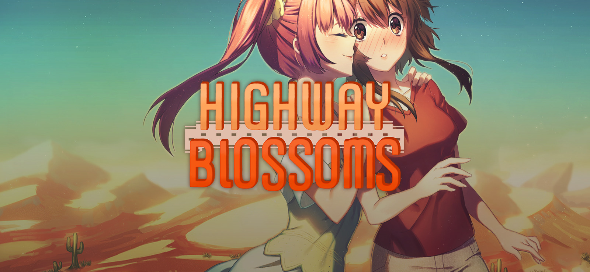

It's rare to come across an American visual novel production -- especially one whose core setting is firmly entrenched in the American Southwest.

> A short yuri story set in the American Midwest. After an old gold rush miner’s journal is discovered, a nationwide craze begins as would-be prospectors try to solve the cryptic clues it contains and discover the miner’s hidden treasure. Amber, couldn’t care less. Wandering the Southwest in an inherited motorhome, she mourns the loss of her grandfather, totally unaware of the hunt taking place around her. It’s not until she meets Marina, a young hitchhiker wandering through the deserts of New Mexico, that things start to look up.

I came to *HB* late. Initially released in 2016 as a voiceless kenetic visual novel, a voice "remastering" was released in 2017 and I snagged a copy. It sat around in my Steam library untouched for almost six months before diving in.

I'm kicking myself it took me so long to experience this gem.

On the visual novel time scale, it's a short read (about six hours) and the basic plot is just a foil for seeing how these characters interact -- and it's the all the characters (but especially Amber and Marina) that make this VN shine.

There is a charm and realism to how all the characters bounce off one another. 

