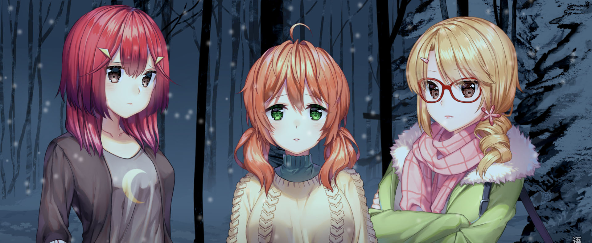

After playing *Highway Blossoms* I was very curious what would come next from Alienworks. Well, it turns out one of the lead writers [Josh Kaplan](https://twitter.com/JkaplanAW) left to start his own [studio](https://twitter.com/vnstudioelan).

> Maddie Raines is the editor and manager for her best friend Tara’s ridiculously popular vlog, Taranormal. Together, the two of them have investigated just about every cryptid and ghost story out there, but never finding anything substantial. Maddie’s expecting more of the same when they travel to a remote German village to look into the legend of a giant forest spirit referred to them by one of their fans. Departing across the ocean just days after Maddie’s decided to quit the show, this trip is supposed to be their last one together. Something’s different this time, though. This time, Maddie finds something: Abigail, the ghost of a girl who lived in the village centuries ago. And the story of the curse that lead to her sacrifice. A curse that has never been broken.

