No one will notice how late this is... will they? This post will be "voiced" as if I was doing it on time. Hopefully a retro will follow not long after.

### [Sword Art Online: Alicization - War of Underworld](https://anilist.co/anime/108759)

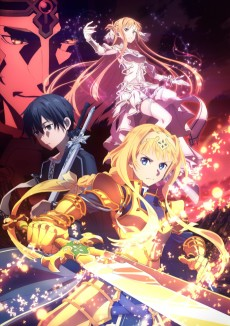
 

> Despite their recent victory against Quinella, Kirito and Alice find themselves in another dangerous situation. The Ocean Turtle, the complex in which resides the machinery that sustains Underworld, is under attack by an unknown enemy, leading to Kirito being thrown into a comatose state. At the same time, in Underworld, forces from the Dark Territory are starting to move to invade the Human Empire.

### [Ore wo Suki nano wa Omae dake ka yo](https://anilist.co/anime/104464)

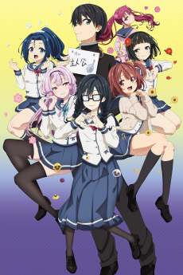

CONNECT

> Amatsuyu &quot;Joro&quot; Kisaragi finds himself in a rather delightful situation, two lovely girls asked him out on a date in the same week. Little does he know he&#x27;s not the actual target of their love, instead, he ends up as a love consultant forced to juggle a web of relationships more complex than initially thought. &lt;br/&gt;

### [BEASTARS](https://anilist.co/anime/107660)

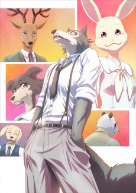

Orange

> In a world populated by anthropomorphic animals, herbivores and carnivores coexist with each other. For the adolescents of Cherryton Academy, school life is filled with hope, romance, distrust, and uneasiness.&lt;br&gt;&lt;br&gt;&lt;br/&gt;The main character is Legoshi the wolf, a member of the drama club. Despite his menacing appearance, he has a very gentle heart. Throughout most of his life, he has always been an object of fear and hatred by other animals, and he’s been quite accustomed to that lifestyle. But soon, he finds himself becoming more involved with his fellow classmates who have their own share of insecurities and finds his life in school changing slowly.&lt;br&gt;&lt;br&gt;
(Source: moetron)

### [PSYCHO-PASS 3](https://anilist.co/anime/108307)

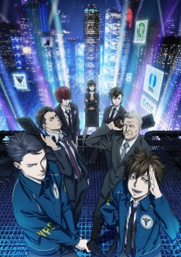
 

> &quot;Justice&quot; opens up a new world. In the near future, the Sybil System, a surveillance network that quantifies human souls, maintains public order. In a changing world, detectives with Dominators, guns that measure &quot;Crime Coefficients,&quot; pursue &quot;latent criminals&quot; before they commit crimes. The third series of PSYCHO-PASS follows two inspectors seeking the truth: Arata Shindo and Kei Mikhail Ignatov.&lt;br&gt;&lt;br&gt;(Source: Amazon)

### [No Guns Life](https://anilist.co/anime/108478)

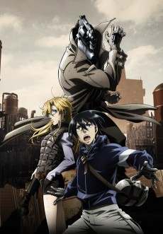
 

> After the war, there are many &quot;Extends&quot; in the city, people whose bodies were modified to make them into dangerous weapons. Inui Juuzou is one of them, and he has no memories of his life and body before his head was transformed into a gun. Strangely enough, his head-gun is designed so that only someone behind him can pull the trigger. Juuzou makes a living by taking on cases involving Extends in the city, and he is assisted by Mary, an intelligent young woman that he has taken under his protection.&lt;br&gt;&lt;br&gt;&lt;br/&gt;
(Source: MangaUpdates)

### [Babylon](https://anilist.co/anime/101349)

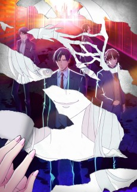
 

Twin Engine, Revoroot

> The suspense story centers around Zen Seizaki, a prosecutor with the Tokyo District Public Prosecutors&#x27; Office. While investigating illegal acts by a certain pharmaceutical company, Seizaki stumbles across a conspiracy over an election for an autonomous &quot;new zone&quot; established in western Tokyo.&lt;br&gt;&lt;br&gt;&lt;br/&gt;
(Source: Anime News Network)

### [Watashi, Nouryoku wa Heikinchi de tte Itta yo ne!](https://anilist.co/anime/101227)

 

project No.9

> When she turns ten years old, Adele von Ascham is hit with a horrible headache–and memories of her previous life as an eighteen-year-old Japanese girl named Kurihara Misato. That life changed abruptly, however, when Misato died trying to aid a little girl and met god. During that meeting, she made an odd request and asked for average abilities in her next life. But few things–especially wishes–ever go quite as planned.&lt;br&gt;&lt;br&gt;&lt;br/&gt;
(Source: Seven Seas Entertainment)

### [Honzuki no Gekokujou: Shisho ni Naru Tame ni wa Shudan wo Erandeiraremasen](https://anilist.co/anime/108268)

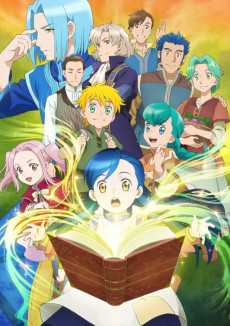
 

Ajia-Do

> Urano, a bookworm who had finally found a job as a librarian at a university, was sadly killed shortly after graduating from college. She was reborn as the daughter of a soldier in a world where the literacy rate is low and books were scarce. No matter how much she wanted to read, there were no books around. What is a bookworm to do without any books? Make them, of course. Her goal is to become a librarian! So that she may once again live surrounded by books, she must start by making them herself.&lt;br&gt;&lt;br/&gt;&lt;br&gt;
&lt;i&gt;Note: The first episode was included in a bonus DVD that came with the limited edition of the 8th volume of &lt;a href&#x3D;&quot;https://anilist.co/manga/110802&quot;&gt;Part 4&lt;/a&gt; of the light novel that was released on September 10th, 2019 prior to its TV premiere.&lt;/i&gt;

### [BLACKFOX](https://anilist.co/anime/101317)

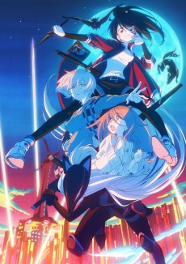
 

Studio 3Hz, Infinite, Flying Ship Studio

> Living in a ninja residence tucked away in a corner of a futuristic city is Rikka, the eldest daughter of a Ninja clan, who looks up to her father—a researcher—very much.&lt;br/&gt;Carrying on with her life normally, Rikka&#x27;s home came suddenly under attack one day. Driven into a corner, what would she do to overcome this crisis?
Rip darkness to pieces and become &quot;BLACK&quot;!&lt;br&gt;&lt;br&gt;

(Source: Official website)

### [Chihayafuru 3](https://anilist.co/anime/101215)

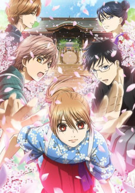
 

MADHOUSE

> They may have just won their most coveted karuta tournament, but members of the Mizusawa karuta team still have a long way to go. Each member chases their dreams, and with a win under their collective belt, those dreams are closer in reach than ever. Chihaya Ayase is determined to challenge Wakamiya Shinobu and win the title of Queen, and Taichi Mashima is ready to take on Arata Wataya now that he’s made it into the most elite of karuta players — but an unexpected revelation will deal these karuta players a hand none of them saw coming.&lt;br&gt;&lt;br&gt;(Source: Sentai Filmworks)

### [Houkago Saikoro Club](https://anilist.co/anime/104115)

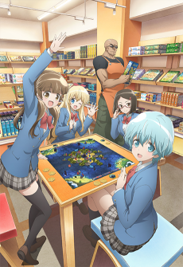
 

> Kyoto in Spring. Aya is a high school girl who’s just moved to a new town. Miki is her shy classmate, and her first friend. One day after school Aya and Miki follow the committee president Midori to a specialty board games store. The Dice Club. Without thinking they try out a German board game together. These girls, who are searching for fun, soon fall into the exciting world of games.&lt;br&gt;&lt;br&gt;&lt;br/&gt;
(Source: MangaUpdates)

### [Rifle Is Beautiful](https://anilist.co/anime/104679)

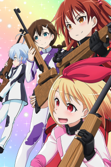
 

> Kokura Hikari is a first-year high school girl who loves rifle shooting. She entered Chidori High School because it had a shooting club, but finds that the club had been disbanded. She had only one day to find enough members to reform the club, but luckily was able to find three other first-year girls who she had met at a competition in middle school.&lt;br/&gt;&lt;br&gt;&lt;br&gt;
Thus begins the daily activities of the Chidori High Shooting Club.

