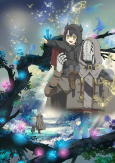
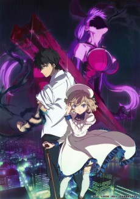
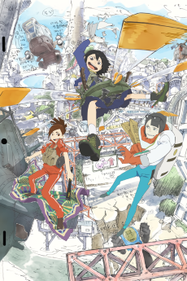
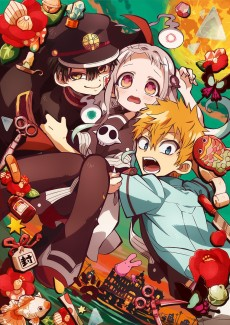
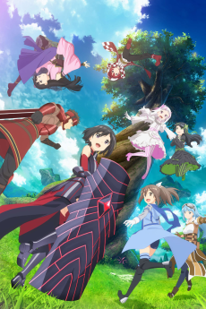
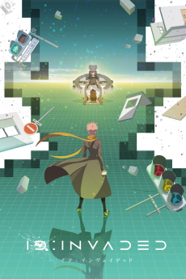
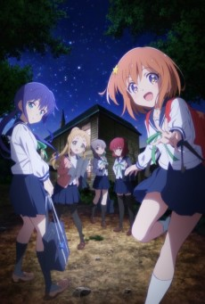
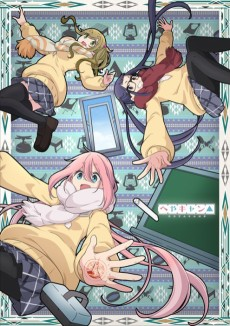
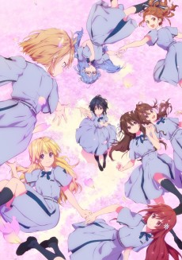

Oh! Didn't see you there... Am I late again?

### [Somali to Mori no Kamisama](https://anilist.co/anime/108617)

Satelight, HORNETS

> &lt;i&gt;The first episode received an advance web distribution on January 3. The regular TV broadcast started on January 10.&lt;/i&gt;&lt;br&gt;&lt;br/&gt;&lt;br&gt;
The world is ruled by a diversity of inhuman beings, who persecuted humans and drove them to near-extinction. One day, the forest guardian Golem meets a human girl. This is a chronicle of a journey that would bind a member of the dying &quot;human&quot; clan to the forest guardian Golem, as father and daughter.
&lt;br&gt;&lt;br&gt;
(Source: Crunchyroll)

### [Kyokou Suiri](https://anilist.co/anime/107201)

 

> At the young age of 11, Kotoko Iwanaga was abducted by youkai for two weeks and asked to become their &quot;God of Wisdom,&quot; a mediator between the spirit and human worlds, to which the girl quickly agreed but at the cost of her right eye and left leg. Now, six years later, whenever youkai wish for their problems to be solved, they make their way to Kotoko for consultation.&lt;br&gt;&lt;br/&gt;&lt;br&gt;
Meanwhile, Kurou Sakuragawa, a 22-year-old university student, has just broken up with his girlfriend after he fled alone when the two encountered a kappa. Seeing this as her chance to become closer with him, Kotoko immediately makes her move, hoping to get married to Kurou one day. However, she quickly realizes there is something more to Kurou. With this knowledge, she asks for his help in solving the various issues presented by the supernatural, all the while wishing her newfound partner will eventually reciprocate her feelings.&lt;br&gt;
&lt;br&gt;
(Source: MyAnimeList)

### [Eizouken ni wa Te wo Dasu na!](https://anilist.co/anime/109298)

Science SARU

> First year high schooler Midori Asakusa loves anime so much, she insists that &quot;concept is everything&quot; in animation. Though she draws a variety of ideas in her sketchbook, she hasn&#x27;t taken the first step to creating anime, insisting that she can&#x27;t do it alone. The producer-type Sayaka Kanamori is the first to notice Asakusa&#x27;s genius. Then, when it becomes clear that their classmate, charismatic fashion model Tsubame Mizusaki, really wants to be an animator, they create an animation club to realize the &quot;ultimate world&quot; that exists in their minds.&lt;br&gt;&lt;br/&gt;&lt;br&gt;
(Source: Crunchyroll)

### [Jibaku Shounen Hanako-kun](https://anilist.co/anime/108463)

 

> &quot;Hanako-san, Hanako-san... are you there?&quot;&lt;br/&gt;&lt;br&gt;&lt;br&gt;
At Kamome Academy, rumors abound about the school&#x27;s Seven Mysteries, one of which is Hanako-san. Said to occupy the third stall of the third floor girls&#x27; bathroom in the old school building, Hanako-san grants any wish when summoned. Nene Yashiro, an occult-loving high school girl who dreams of romance, ventures into this haunted bathroom... but the Hanako-san she meets there is nothing like she imagined! Kamome Academy&#x27;s Hanako-san... is a boy!
&lt;br&gt;&lt;br&gt;
(Source: Yen Press)

### [Itai no wa Iya nano de Bougyoryoku ni Kyokufuri Shitai to Omoimasu.](https://anilist.co/anime/106479)

 

> The story centers on Kaede Honjou, who is invited by her friend Risa Shiramine to play a virtual reality MMO game with her. While Kaede doesn&#x27;t dislike games, what she really, truly dislikes is being in pain. She creates a character named Maple, and decides to put all her points in VIT to minimize pain. As a result, she moves slowly, can&#x27;t use magic, and even a rabbit can get the best of her. However, as it turns out, she acquires a skill known as &quot;Absolute Defense&quot; as a result of her pumping points into VIT, as well as a &quot;Counter Skill&quot; that works against special moves. Now, with her ability to nullify all damage, she goes on adventures.&lt;br&gt;&lt;br&gt;(Source: Anime News Network, edited)

### [Magia Record: Mahou Shoujo Madoka☆Magica Gaiden](https://anilist.co/anime/104051)

 

> A dream of an unknown girl beckons Iroha Tamaki to Kamihama City, a mysterious place where Magical Girls gather and Witches of unimaginable strength proliferate. A new power drawn from evil Witches is on the rise, and as the mysteries of Kamihama begin to come to light, Iroha is sure of one thing only: understanding the secrets of Kamihama is the key to unlocking the identity of the enigmatic — and inexplicably familiar — girl in her dreams.&lt;br&gt;&lt;br&gt;(Source: HIDIVE)

### [ID: INVADED](https://anilist.co/anime/110350)

NAZ

> Welcome to Kura, an organization that investigates crime using the Mizuhanome system which senses the drive to kill. Sakaido is a brilliant detective and pilot of the Mizuhanome. To solve a case, he enters the world of the killer&#x27;s unconscious mind: the id well. In the shadows of brutal and puzzling cases lurks John Walker, the Serial Killer Creator. Where will Sakaido&#x27;s pursuit lead?&lt;br&gt;&lt;br/&gt;&lt;br&gt;
(Source: Funimation)

### [Toaru Kagaku no Railgun T](https://anilist.co/anime/104462)

 

> The third season of &lt;i&gt;Toaru Kagaku no Railgun&lt;/i&gt;.&lt;br&gt;&lt;br&gt;&lt;br/&gt;
Misaka’s electro-manipulation abilities—and delightfully destructive Railgun projectile move—make her a rock star in Academy City. The techno-metropolis is packed with supernaturally powered students known as espers, including Misaka’s flirty friend and roommate, Kuroko. In this city full of super-powered gangs, mad scientists, and monsters—there’s no shortage of action!&lt;br&gt;&lt;br&gt;
(Source: Crunchyroll)

### [Koisuru Asteroid](https://anilist.co/anime/108092)

 

> When she was little, Konohata Mira promises a boy she meets at a campsite that they can find a galaxy together. When she enters high school, she joins the astronomy club. But that year, the astronomy club happened to combine with the geology club, making it the astrogeo club?!&lt;br&gt;&lt;br/&gt;&lt;br&gt;
Won&#x27;t you find all kinds of sparkles with the astrogeo girls?&lt;br&gt;
&lt;br&gt;
(Source: Crunchyroll)

### [Heya Camp△](https://anilist.co/anime/104461)

C-Station

> The Outdoor Activities Club, Aka, the Outclub has 3 members. In the countryside of Yamanashi Prefecture, there’s a high school named Motosu High School. Go even further to one of the school buildings and you’ll find a very laid-back outdoor club that uses one corner of the classroom as their club room. Kagamihara Nadeshiko finally wants to kill some time in their club room, but then Ohgaki Chiaki and Inuyama Aoi suddenly announce that they’re all going on a trip. The girls enjoy the various local treats as they travel around, but where in the world is the end destination for this trip?!&lt;br&gt;&lt;br/&gt;&lt;br&gt;
(Source: Crunchyroll)

### [22/7](https://anilist.co/anime/99807)

 

> One day, Miu Takigawa suddenly receives a letter notifying her that she has been chosen as a member of a brand-new project. Half in disbelief, she heads over to the location stated on the letter. There, she finds seven other girls summoned there in the same fashion. The girls behold a giant, top-secret facility. They stand in bewilderment as they are told:&lt;br&gt;&lt;br/&gt;&lt;br&gt;
&quot;You are going to debut for a major record label as an idol group.&quot;&lt;br&gt;
&lt;br&gt;
A new kind of idol, never-before-seen, is about to be born here…&lt;br&gt;
&lt;br&gt;

### [Oshi ga Budoukan Ittekuretara Shinu](https://anilist.co/anime/104391)

 

>  Eripiyo is an extreme idol fan. She is wildly enthusiastic about Maina, the shy and lowest-ranking member of the minor underground idol group ChamJam that performs in Okayama Prefecture. Eri will continue to give her complete devotion to Maina until the day she can perform at Budokan.&lt;br&gt;&lt;br&gt;(Source: Anime News Network, edited)

