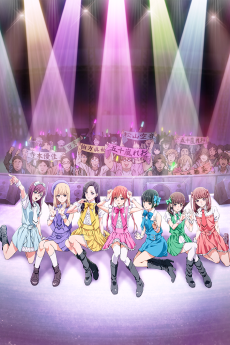

### [Haikyuu!! TO THE TOP](https://anilist.co/anime/106625)

 

Production I.G

> The fourth season of &lt;i&gt;Haikyuu!!&lt;/i&gt;&lt;br&gt;&lt;br&gt;The Karasuno High School Volleyball Club finally won their way into the nationals after an intense battle for the Miyagi Prefecture Spring Tournament qualifiers. As they were preparing for the nationals, Kageyama is invited to go to All-Japan Youth Training Camp. At the same time, Tsukishima is invited to go to a special rookie select training camp for first-years in Miyagi Prefecture. Hinata feels panic that he’s being left behind as one of the first-years and then decides to show up at the Miyagi Prefecture rookie select training camp anyway... &lt;br&gt;&lt;br&gt;(Source: Crunchyroll)

### [Made in Abyss: Fukaki Tamashii no Reimei](https://anilist.co/anime/100643)

 

Kinema Citrus

> &lt;i&gt;Dawn of the Deep Soul&lt;/i&gt; continues the epic adventure of plucky Riko and Reg who are joined by their new friend Nanachi. Together they descend into the Abyss’ treacherous fifth layer, the Sea of Corpses, and encounter the mysterious Bondrewd, a legendary White Whistle whose shadow looms over Nanachi’s troubled past. Bondrewd is ingratiatingly hospitable, but the brave adventurers know things are not always as they seem in the enigmatic Abyss...&lt;br&gt;&lt;br/&gt;&lt;br&gt;
(Source: Sentai Filmworks)

### [Somali to Mori no Kamisama](https://anilist.co/anime/108617)

 

Satelight, HORNETS

> &lt;i&gt;The first episode received an advance web distribution on January 3. The regular TV broadcast started on January 10.&lt;/i&gt;&lt;br&gt;&lt;br/&gt;&lt;br&gt;
The world is ruled by a diversity of inhuman beings, who persecuted humans and drove them to near-extinction. One day, the forest guardian Golem meets a human girl. This is a chronicle of a journey that would bind a member of the dying &quot;human&quot; clan to the forest guardian Golem, as father and daughter.
&lt;br&gt;&lt;br&gt;
(Source: Crunchyroll)

### [Darwin&#x27;s Game](https://anilist.co/anime/105190)

 

Nexus

> Kaname Sudo, an ordinary high school student, receives an invitation email to try a mysterious app called &quot;Darwin&#x27;s Game.&quot; Kaname, upon launching the app, is drawn into a game where players fight one another using superpowers called Sigils.&lt;br&gt;&lt;br/&gt;&lt;br&gt;
Without knowing the reason for all this, can Kaname survive furious battles against the powerful players who attack him?&lt;br&gt;
&lt;br&gt;
(Source: Aniplex of America)

### [Kyokou Suiri](https://anilist.co/anime/107201)

 

Brain&#x27;s Base, NAS

> At the young age of 11, Kotoko Iwanaga was abducted by youkai for two weeks and asked to become their &quot;God of Wisdom,&quot; a mediator between the spirit and human worlds, to which the girl quickly agreed but at the cost of her right eye and left leg. Now, six years later, whenever youkai wish for their problems to be solved, they make their way to Kotoko for consultation.&lt;br&gt;&lt;br/&gt;&lt;br&gt;
Meanwhile, Kurou Sakuragawa, a 22-year-old university student, has just broken up with his girlfriend after he fled alone when the two encountered a kappa. Seeing this as her chance to become closer with him, Kotoko immediately makes her move, hoping to get married to Kurou one day. However, she quickly realizes there is something more to Kurou. With this knowledge, she asks for his help in solving the various issues presented by the supernatural, all the while wishing her newfound partner will eventually reciprocate her feelings.&lt;br&gt;
&lt;br&gt;
(Source: MyAnimeList)

### [Eizouken ni wa Te wo Dasu na!](https://anilist.co/anime/109298)

 

Science SARU

> First year high schooler Midori Asakusa loves anime so much, she insists that &quot;concept is everything&quot; in animation. Though she draws a variety of ideas in her sketchbook, she hasn&#x27;t taken the first step to creating anime, insisting that she can&#x27;t do it alone. The producer-type Sayaka Kanamori is the first to notice Asakusa&#x27;s genius. Then, when it becomes clear that their classmate, charismatic fashion model Tsubame Mizusaki, really wants to be an animator, they create an animation club to realize the &quot;ultimate world&quot; that exists in their minds.&lt;br&gt;&lt;br/&gt;&lt;br&gt;
(Source: Crunchyroll)

### [Jibaku Shounen Hanako-kun](https://anilist.co/anime/108463)

 

Lerche

> &quot;Hanako-san, Hanako-san... are you there?&quot;&lt;br/&gt;&lt;br&gt;&lt;br&gt;
At Kamome Academy, rumors abound about the school&#x27;s Seven Mysteries, one of which is Hanako-san. Said to occupy the third stall of the third floor girls&#x27; bathroom in the old school building, Hanako-san grants any wish when summoned. Nene Yashiro, an occult-loving high school girl who dreams of romance, ventures into this haunted bathroom... but the Hanako-san she meets there is nothing like she imagined! Kamome Academy&#x27;s Hanako-san... is a boy!
&lt;br&gt;&lt;br&gt;
(Source: Yen Press)

### [Itai no wa Iya nano de Bougyoryoku ni Kyokufuri Shitai to Omoimasu.](https://anilist.co/anime/106479)

 

SILVER LINK.

> The story centers on Kaede Honjou, who is invited by her friend Risa Shiramine to play a virtual reality MMO game with her. While Kaede doesn&#x27;t dislike games, what she really, truly dislikes is being in pain. She creates a character named Maple, and decides to put all her points in VIT to minimize pain. As a result, she moves slowly, can&#x27;t use magic, and even a rabbit can get the best of her. However, as it turns out, she acquires a skill known as &quot;Absolute Defense&quot; as a result of her pumping points into VIT, as well as a &quot;Counter Skill&quot; that works against special moves. Now, with her ability to nullify all damage, she goes on adventures.&lt;br&gt;&lt;br&gt;(Source: Anime News Network, edited)

### [Magia Record: Mahou Shoujo Madoka☆Magica Gaiden](https://anilist.co/anime/104051)

 

Shaft

> A dream of an unknown girl beckons Iroha Tamaki to Kamihama City, a mysterious place where Magical Girls gather and Witches of unimaginable strength proliferate. A new power drawn from evil Witches is on the rise, and as the mysteries of Kamihama begin to come to light, Iroha is sure of one thing only: understanding the secrets of Kamihama is the key to unlocking the identity of the enigmatic — and inexplicably familiar — girl in her dreams.&lt;br&gt;&lt;br&gt;(Source: HIDIVE)

### [Plunderer](https://anilist.co/anime/101168)

 

Geek Toys

> Every human inhabiting the world of Alcia is branded by a “Count” or a number written on their body. Depending on how each person lives their life, this Count either goes up or down. For Hina’s mother, her total drops to 0 and she’s pulled into the Abyss, never to be seen again. But her mother’s last words send Hina on a quest to find a legendary hero from the Waste War—the fabled Ace!&lt;br&gt;&lt;br/&gt;&lt;br&gt;
(Source: Funimation)

### [Ishuzoku Reviewers](https://anilist.co/anime/110270)

 

Passione

> Beauty truly is in the eye of the beholder! From elves to succubi to cyclopes and more, the Yoruno Gloss reviewers are here to rate the red-light delights of all manner of monster girls...The only thing is, they can never agree on which species are the hottest!&lt;br/&gt;&lt;br&gt;&lt;br&gt;
(Source: Yen Press)

### [ID: INVADED](https://anilist.co/anime/110350)

 

NAZ

> Welcome to Kura, an organization that investigates crime using the Mizuhanome system which senses the drive to kill. Sakaido is a brilliant detective and pilot of the Mizuhanome. To solve a case, he enters the world of the killer&#x27;s unconscious mind: the id well. In the shadows of brutal and puzzling cases lurks John Walker, the Serial Killer Creator. Where will Sakaido&#x27;s pursuit lead?&lt;br&gt;&lt;br/&gt;&lt;br&gt;
(Source: Funimation)

### [Rikei ga Koi ni Ochita no de Shoumeishitemita.](https://anilist.co/anime/107067)

 

Zero-G

> Yukimura Shinya, and Himuro Ayame are two scientists that want to find out if love can be solved by a scientific theory. These two scientists also have feelings for each other and want to be able to solve their true feelings through similar theoretical facts. With this perfect opportunity, these scientists will attempt to solve the theory of the love they express for each other.&lt;br/&gt;&lt;br&gt;&lt;br&gt;
(Source: MangaUpdates)&lt;br&gt;&lt;br&gt;&lt;h1&gt;&lt;i&gt;All episodes premiered on Amazon Prime on January 11, but aired weekly on TV.&lt;/i&gt;&lt;/h1&gt;

### [Dorohedoro](https://anilist.co/anime/105228)

 

MAPPA

> The story revolves around Kaiman, who does not remember who he was before he was transfigured by a Magic user. This transformation left him with a reptile&#x27;s head, and a desire to find out the truth about who he really is. Accompanied by Nikaido, his female companion, he tracks down Magic Users in &quot;The Hole&quot; and unceremoniously chomps down on their head, hoping to find out who it was that put him in this state. One by one, they witness this &quot;second man&quot; inside the head of Kaiman, and after pulling them back out of his mouth he asks them all a question... &quot;What did the guy inside my head say?&quot;&lt;br&gt;&lt;br&gt;&lt;br/&gt;(Source: MangaUpdates)

### [Toaru Kagaku no Railgun T](https://anilist.co/anime/104462)

 

J.C. Staff

> The third season of &lt;i&gt;Toaru Kagaku no Railgun&lt;/i&gt;.&lt;br&gt;&lt;br&gt;&lt;br/&gt;
Misaka’s electro-manipulation abilities—and delightfully destructive Railgun projectile move—make her a rock star in Academy City. The techno-metropolis is packed with supernaturally powered students known as espers, including Misaka’s flirty friend and roommate, Kuroko. In this city full of super-powered gangs, mad scientists, and monsters—there’s no shortage of action!&lt;br&gt;&lt;br&gt;
(Source: Crunchyroll)

### [Isekai Quartet 2](https://anilist.co/anime/110178)

 

Studio PuYUKAI

> The second season of &lt;i&gt;Isekai Quartet&lt;/i&gt;.

### [pet](https://anilist.co/anime/101350)

 

Geno Studio, Twin Engine

> The psychic suspense story revolves around people who possess the ability to infiltrate people&#x27;s minds and manipulate memories. Their powers have been used in the underworld for covering up incidents, assassinations, and other deeds. These powers can not only destroy other people&#x27;s spirits, but also corrupt the users&#x27; own hearts at the same time. The users had to protect their fragile and insecure hearts, as if chained to each other. They are called &quot;pets&quot; out of fear and despising.&lt;br&gt;&lt;br&gt;&lt;br/&gt;
(Source: Anime News Network)

### [Nekopara](https://anilist.co/anime/106863)

 

Felix Film

> In this world, cats aren&#x27;t furry four-footed creatures, but human-like girls with ears, tails, and cat-like behaviors. Still kept as pets, they&#x27;re allowed out on their own if they pass a special training and wear their bells. A young man running his own patisserie lives with two of these cats, Chocola and Vanilla, who help him out around the store. Maple and Cinnamon, two of the cats from home, also come in everyday, and together they enjoy a sweet life. Even if the cats don&#x27;t always get along – and Azuki and Coconut certainly don&#x27;t – things are peaceful and calm until a stray kitten follows Chocola home.&lt;br&gt;&lt;br&gt;&lt;br/&gt;(Source: Anime News Network)

### [Goblin Slayer: GOBLIN&#x27;S CROWN](https://anilist.co/anime/108623)

 

White Fox

> A sequel movie to the TV series which adapts the 5th light novel.

### [Infinite Dendrogram](https://anilist.co/anime/107420)

 

NAZ

> In the year 2043, Infinite Dendrogram, the world&#x27;s first successful full-dive VRMMO was released. In addition to its ability to perfectly simulate the five senses, along with its many other amazing features, the game promised to offer players a world full of infinite possibilities. &lt;br&gt;&lt;br&gt;Nearly two years later, soon-to-be college freshman, Reiji Mukudori, is finally able to buy a copy of the game and start playing. With some help from his experienced older brother, Shuu, and his partner Embryo, Reiji embarks on an adventure into the world of Infinite Dendrogram. Just what will he discover and encounter in this game world known for its incredible realism and infinite possibilities?&lt;br&gt;&lt;br&gt;&lt;br/&gt;(Source: J-Novel Club)

### [Koisuru Asteroid](https://anilist.co/anime/108092)

 

Doga Kobo

> When she was little, Konohata Mira promises a boy she meets at a campsite that they can find a galaxy together. When she enters high school, she joins the astronomy club. But that year, the astronomy club happened to combine with the geology club, making it the astrogeo club?!&lt;br&gt;&lt;br/&gt;&lt;br&gt;
Won&#x27;t you find all kinds of sparkles with the astrogeo girls?&lt;br&gt;
&lt;br&gt;
(Source: Crunchyroll)

### [Haikyuu!! Riku VS Kuu](https://anilist.co/anime/111790)

 

Production I.G

> First exhibited at Jump Festa 2020. &lt;br&gt;&lt;br&gt;In the Miyagi Prefecture qualifiers for the Spring Tournament, Karasuno High School Volleyball Team manages to defeat Shiratorizawa Academy in an intense battle and secures their spot in the national tournament. Meanwhile in the Tokyo qualifiers, Nekoma High School, Fukurodani High School, Nohebi Academy, and Itachiyama Academy fight for the 3 slots to go to nationals.&lt;br&gt;&lt;br&gt;Will Nekoma High School be able to secure their spot in the tournament? Will we able to see a rematch of Nekoma and Karasuno&#x27;s Battle of the Garbage Dump on a national level? The Tokyo qualifiers are about to begin!!&lt;br&gt;&lt;br&gt;(Source: Crunchyroll)

### [Murenase! Seton Gakuen](https://anilist.co/anime/112293)

 

Studio Gokumi

> Seton Academy, a school where animals of all species gather to live and learn together. A sacred garden of learning, where students hone their primal instincts and the laws are of the jungle. Where species pit against species in a daily struggle for survival... Now enter the animal-hating human Jin Mazama, and the lonely wolf Ranka Okami. When man meets wolf in an encounter for the ages, this food chain is about to be shook. “Species shmecies! If we’ve shared face-licks, you’re a friend to me! Welcome to the pack!”&lt;br&gt;&lt;br/&gt;&lt;br&gt;
(Source: Crunchyroll)

### [Heya Camp△](https://anilist.co/anime/104461)

 

C-Station

> The Outdoor Activities Club, Aka, the Outclub has 3 members. In the countryside of Yamanashi Prefecture, there’s a high school named Motosu High School. Go even further to one of the school buildings and you’ll find a very laid-back outdoor club that uses one corner of the classroom as their club room. Kagamihara Nadeshiko finally wants to kill some time in their club room, but then Ohgaki Chiaki and Inuyama Aoi suddenly announce that they’re all going on a trip. The girls enjoy the various local treats as they travel around, but where in the world is the end destination for this trip?!&lt;br&gt;&lt;br/&gt;&lt;br&gt;
(Source: Crunchyroll)

### [Runway de Waratte](https://anilist.co/anime/111501)

 

Ezo’la

> Chiyuki Fujito has a dream: to become a Paris Collection model. The problem is, she&#x27;s too short to be a model, and everyone around her tells her so! But no matter what they say, she won&#x27;t give up. Her classmate, a poor student named Ikuto Tsumura, also has a dream: to become a fashion designer. One day Chiyuki tells him that it&#x27;s &quot;probably impossible&quot; for him, causing him to consider giving it up...?! This is the story of two individuals wholeheartedly chasing after their dreams in spite of all the negativity that comes after them!&lt;br&gt;&lt;br&gt;(Source: Kodansha Comics)

### [Majutsushi Orphen Hagure Tabi](https://anilist.co/anime/101367)

 

Studio DEEN, Genco

> A remake of the original 1998-1999 anime of the same name, to commemorate the novels&#x27; 25th anniversary. &lt;br&gt;&lt;br/&gt;&lt;br&gt; Orphen is the greatest sorcerer that the tower has ever seen but he is more interested in chasing the Bloody August, an infamous and very mysterious dragon. Along with his apprentice Majic and their companion Clio he heads off on a quest with the Sword of Baltanders, the only thing that can free the Bloody August or &#x27;Azile&#x27; from the spell she is under.&lt;br&gt;
&lt;br&gt;(Source: Anime News Network)

### [SHIROBAKO Movie](https://anilist.co/anime/101574)

 

P.A. Works, Infinite

> The story is set four years after the events of the original &lt;i&gt;Shirobako&lt;/i&gt; anime. Aoi Miyamori keeps busy dealing with the ordinary troubles in her daily work at Musashino Animation. After a morning meeting, Watanabe talks to Aoi and puts her in charge of a new theatrical anime project for the studio. The project has unexpected problems, and Aoi is unsure if the company can proceed with a theatrical anime with its current state of affairs. While dealing with that anxiety, Aoi meets a new colleague named Kaede Miyai. She and the MusAni team work together to complete the project.&lt;br&gt;&lt;br/&gt;&lt;br&gt;
(Source: Anime News Network)

### [Dungeon ni Deai wo Motomeru no wa Machigatteiru Darou ka II OVA](https://anilist.co/anime/112125)

 

J.C. Staff

> Bell and the gang found themselves in a hot spring at the end of their last adventure, and this time they’re ready for a little R&amp;R at the beach! Hestia, Lili and Haruhime waste no time trying to win Bell over with their charms and run into unexpected competition once Ais crashes the party. However, the usually stoic sword maiden is acting surprisingly carefree...&lt;br&gt;&lt;br/&gt;&lt;br&gt;
(Source: Sentai Filmworks)

### [22/7](https://anilist.co/anime/99807)

 

A-1 Pictures

> One day, Miu Takigawa suddenly receives a letter notifying her that she has been chosen as a member of a brand-new project. Half in disbelief, she heads over to the location stated on the letter. There, she finds seven other girls summoned there in the same fashion. The girls behold a giant, top-secret facility. They stand in bewilderment as they are told:&lt;br&gt;&lt;br/&gt;&lt;br&gt;
&quot;You are going to debut for a major record label as an idol group.&quot;&lt;br&gt;
&lt;br&gt;
A new kind of idol, never-before-seen, is about to be born here…&lt;br&gt;
&lt;br&gt;
(Source: Aniplex of America)

### [Boku no Tonari ni Ankoku Hakaishin ga Imasu.](https://anilist.co/anime/104936)

 

EMT Squared

> Seri Koyuki is just trying to have a normal school life, but instead he ends up acting as the straight man to his odd classmate, Kabuto Hanadori. Kabuto is is a delusional high school student, whose fantasies range from believing he is a knight on a journey, to claiming that removing his eyepatch will release a darker alter-ego who he refers to as Michael Offenbarung Dunkelheit. Seri is determined not to let himself get pushed around by Kabuto, but it seems that this will be easier said than done!

### [Hatena☆Illusion](https://anilist.co/anime/98515)

 

Children&#x27;s Playground Entertainment

> The series centers on Makoto Shiranui, a boy who travels to Tokyo seeking to become the apprentice of Mamoru Hoshisato, a world-famous magician and friend of his parents. Ever since he had watched a show by Mamoru and his wife Maive, he had dreamed of being a magician. Their daughter Kana (nicknamed Hatena) has been Makoto&#x27;s friend since childhood. Even though Tokyo has had a rash of burglaries by a beautiful woman thief, Makoto can rest easy as long as Hatena is there. When he arrives at the Hoshisato residence, a haunted mansion, the family butler Jeeves and the maid Emma greet him, and he is reunited with Hatena, only to find out that they don&#x27;t really get along now.&lt;br&gt;&lt;br&gt;&lt;br/&gt;
(Source: Anime News Network)

### [Oshi ga Budoukan Ittekuretara Shinu](https://anilist.co/anime/104391)

 

8-bit, TBS

>  Eripiyo is an extreme idol fan. She is wildly enthusiastic about Maina, the shy and lowest-ranking member of the minor underground idol group ChamJam that performs in Okayama Prefecture. Eri will continue to give her complete devotion to Maina until the day she can perform at Budokan.&lt;br&gt;&lt;br&gt;(Source: Anime News Network, edited)

### [Natsunagu!](https://anilist.co/anime/113397)

 

Imagica Lab.

> The story follows the coming-of-age of Natsuna Keyaki, a college student from Tokyo who goes to Kumamoto after losing contact with her friend after the 2016 earthquakes. There, she meets individuals with colorful personalities, such as middle school girl Izumi, who begin to light a passion in Natsuna.&lt;br&gt;&lt;br&gt;&lt;br/&gt;
(Source: Anime News Network, edited)

### [Housekishou Richard-shi no Nazo Kantei](https://anilist.co/anime/111951)

 

Studio Shuka

> The &#x27;heartwarming jewel mystery&#x27; series centers on the handsome jewelry appraiser Richard Ranashinha de Vulpian and the bright and cheerful college student Seigi Nakata as they uncover the hidden messages that lie within jewels while they solve various jewel-related cases by unravelling the hidden psychological aspects of their owners that lie within the gems.&lt;br/&gt;&lt;br&gt;&lt;br&gt;
(Source: Anime News Network, Edited)

### [Kuutei Dragons](https://anilist.co/anime/108450)

 

POLYGON PICTURES

> It&#x27;s time to see what dragon tastes like. The crew of the airship Queen Zaza makes their living hunting dragons. Succeed, and the reward is riches and all the meat they can eat! Fail, and all that awaits them is a messy end. Follow the grand hunting and cooking adventure of the Queen Zaza as they chase dragons across the sky.&lt;br&gt;&lt;br&gt;&lt;i&gt;All episodes premiered on Netflix on January 9, but aired weekly on TV&lt;/i&gt;.

### [BanG Dream! 3rd Season](https://anilist.co/anime/101634)

 

SANZIGEN

> The third season of &lt;i&gt;BanG Dream!&lt;/i&gt;&lt;br&gt;&lt;br/&gt;&lt;br&gt;
The girl-powered bands are gigging again. That means Poppin’Party and other fan favorites are set to return for an all new season of BanG Dream! Now that Kasumi and the rest of Poppin’Party are taking charge of their own show, the sky’s the limit for their rockin’ musical ambitions and dreams of stardom. But they’ll have to contend with other bands looking for their big break, and their friendship will be put to the ultimate test as they rock their way to the top of the charts!&lt;br&gt;
&lt;br&gt;
(Source: Sentai Filmworks)&lt;br&gt;&lt;br&gt;

&lt;i&gt;Episodes are being released ahead of the official broadcast date via Blu-ray.&lt;/i&gt;

### [number24](https://anilist.co/anime/108628)

 

PRA

> The anime&#x27;s college rugby story centers on Natsusa Yuzuki, who expects to be an ace on the rugby team when he enrolls in college. However, he is no longer able to play rugby due to certain circumstances. Ibuki Ueoka is an older fellow student who quit rugby. Yasunari Tsuru is a younger student who finds Natsusa disagreeable. Yuu Mashiro is a younger student who admires and follows Natsusa. Seiichirou Shingyou is Natsusa&#x27;s close childhood friend. Together, they compete in the Kansai university rugby league.&lt;br&gt;&lt;br/&gt;&lt;br&gt;
(Source: Anime News Network)

### [Tsuujou Kougeki ga Zentai Kougeki de Ni-kai Kougeki no Okaasan wa Suki desu ka? OVA](https://anilist.co/anime/110445)

 

J.C. Staff

> What would you do if you got transported into a video game...with your mom?? That&#x27;s the dilemma facing high schooler Masato Oosuki, who has been unwittingly thrown into an RPG world with his doting mother close behind as part of a secret government scheme. As an avid gamer, Masato is eager to show off his skills...but that&#x27;s hard to do when your mom is an insanely overpowered, dual-wielding, multi-target specialist!&lt;br/&gt;
(Source: Yen Press)

### [Oda Cinnamon Nobunaga](https://anilist.co/anime/110613)

 

Studio Signpost, Studio Pierrot

> The Warring States Period is a time of feuding warlords. Oda Nobunaga, the greatest of them all, is reborn in modern-day Japan... as a shiba-inu! The other generals of the era, too, have also inexplicably been reborn as dogs. Their warring states rivalry will resume at the dog park!&lt;br&gt;&lt;br&gt;(Source: Crunchyroll)

### [Strike the Blood IV](https://anilist.co/anime/112296)

 

CONNECT

> 

### [Uchitama?! Uchi no Tama Shirimasenka?](https://anilist.co/anime/109964)

 

MAPPA, Lapin Track

> Spin-off of &quot;Tama and Friends&quot; that reimagines the cast of the franchise as humans.&lt;br&gt;&lt;br/&gt;&lt;br&gt;
“Tama &amp; Friends: Have you seen my Tama?” debuted in 1983 as a popular character on stationery and accessories. Tama, the beloved neighborhood cat who is known for the patch on his forehead and yellow ears, has now taken on a human form! Featuring Tama and his quirky friends, Uchitama is a brand-new type of heartwarming anime that might even be the new definition of kawaii!?&lt;br&gt;
&lt;br&gt;
In a city somewhere in Japan, there&#x27;s a flyer often seen on Third Street with a picture of a cat with a kinked tail, bearing the words: “Have you seen Tama?” A young boy gazes at the flyer, but he has fluffy ears on his head…!? Watch the dogs and cats from Third Street take on a human form and get up to some mischief.&lt;br&gt;
&lt;br&gt;
Take a peek into the wonderful lives of Tama and his friends.&lt;br&gt;
&lt;br&gt;
(Source: Aniplex of America)

### [A3! SEASON SPRING ＆ SUMMER](https://anilist.co/anime/107651)

 

Studio 3Hz, P.A. Works, Infinite

> Mankai Company is a far cry from its glory days as an all-male theater. With only one member left and debt collectors at the door, it’s no wonder Izumi Tachibana finds herself in over her head when she boldly confronts the yakuza’s loan sharks, promising to bring her father’s theater back into the spotlight. She might be able to recruit enough talent, but can they bloom into the actors she needs?&lt;br&gt;&lt;br/&gt;&lt;br&gt;
(Source: Funimation)

### [Yatogame-chan Kansatsu Nikki 2 Satsume](https://anilist.co/anime/110090)

 

> The second season of &lt;i&gt;Yatogame-chan Kansatsu Nikki&lt;/i&gt;.

### [High School Fleet Movie](https://anilist.co/anime/101499)

 

A-1 Pictures, Aniplex

> Announced in April 2018.

### [Saezuru Tori wa Habatakanai: The Clouds Gather](https://anilist.co/anime/109171)

 

GRIZZLY

> Yashiro is the young leader of Shinseikai and the president of the Shinseikai Enterprise, but like so many powerful men, he leads a double life as a deviant and a masochist. Doumeki Chikara comes to work as a bodyguard for him and, although Yashiro had decided that he would never lay a hand on his own men, he finds there&#x27;s something about Doumeki that he can&#x27;t resist. Yashiro makes advances toward Doumeki, but Doumeki has mysterious reasons for denying. Yashiro, who abuses his power just to abuse himself, and Doumeki, who faithfully obeys his every command, begin the tumultuous affair of two men with songs in their hearts and no wings to fly.&lt;br/&gt;&lt;br&gt;&lt;br&gt;
(Source: Juné)

### [Show By Rock!! Mashumairesh!!](https://anilist.co/anime/113470)

 

Kinema Citrus, POLYGON PICTURES

> The new anime will center around the band Mashumairesh!!!!, which includes guitarist and vocalist Howan of fox lineage, guitarist and vocalist MashimaHimeko of striped cat lineage, bassist and vocalist Delmin of the Devilmint Kiryuu lineage, and drummer and vocalist Ruhuyu of wolf-girl lineage.&lt;br&gt;&lt;br/&gt;&lt;br&gt;
(Source: Anime News Network)

### [Breakers](https://anilist.co/anime/113851)

 

ALBACROW, NHK, NHK Enterprises

> The anime centers on para-athletes who all meet an outcast sports scientist named Ren Narita. The anime has four stories about four different sports: wheelchair basketball, track and high jump, goalball, and paralympic swimming.&lt;br&gt;&lt;br&gt;(Source: Anime News Network)

### [Nakanohito Genome [Jikkyouchuu]: Knots of Memories](https://anilist.co/anime/112177)

![Nakanohito Genome [Jikkyouchuu]: Knots of Memories](covers/bx112177-dzPKFocyvP53.png)
 

SILVER LINK.

> An original story included with volume 10 of the Nakanohito Genome [Jikkyouchuu] manga.

### [Overflow](https://anilist.co/anime/113417)

 

Studio Hokiboshi

> Male college student Kazushi Sudou and his childhood friends, the Shirakawa sisters, end up bathing together.&lt;br&gt;&lt;br&gt;(Source: Anime News Network)

### [Zenonzard THE ANIMATION](https://anilist.co/anime/112033)

 

8-bit

> The year 20XX. Humans called &quot;Concodes&quot; and ultra-high-performance AI called &quot;Codeman&quot; team up as buddies to compete in the card battle game ZENONZARD. People are going wild with excitement at the world championships, THE ZENON.&lt;br&gt;&lt;br&gt;One day, Souta Azuma, an average high school student, is challenged to a battle by a mysterious woman, Eilietta Lash. She reveals that she’s a Codeman and that her intent is to team up with Souta and participate in THE ZENON. Souta reluctantly agrees. Souta and Eilietta’s first opponent turns out to be the super-famous player Shion Saionji, who attends Souta’s school, and her buddy, Ash Claude.&lt;br&gt;&lt;br&gt;(Source: Zenonzard YouTube channel)

