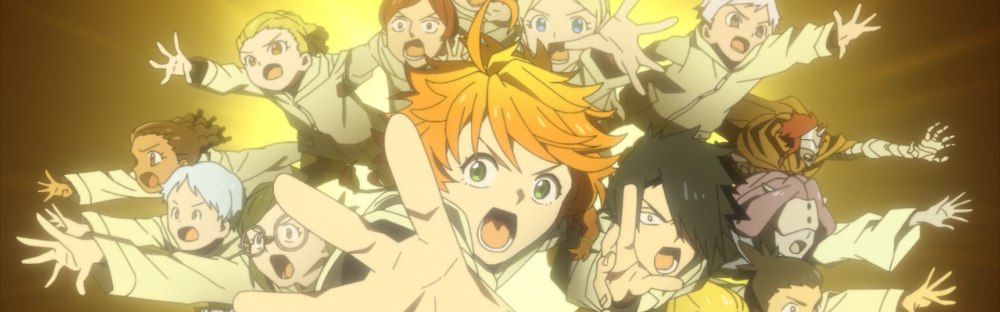
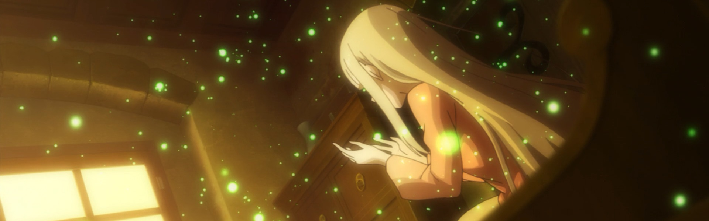
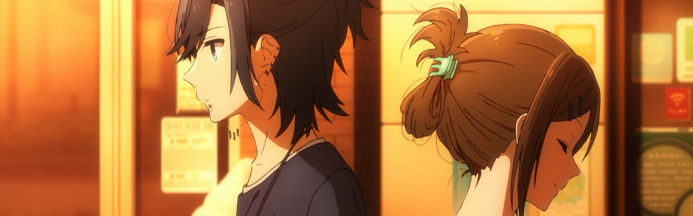
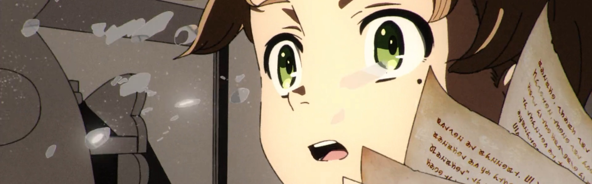
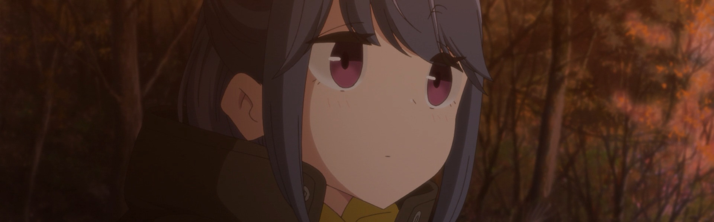
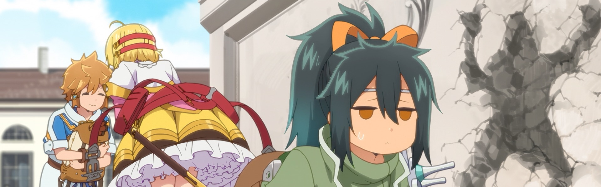
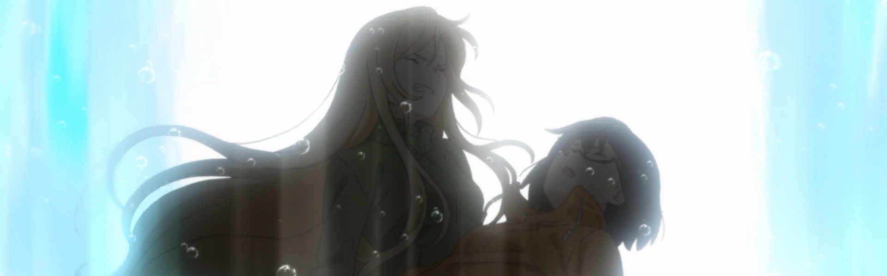
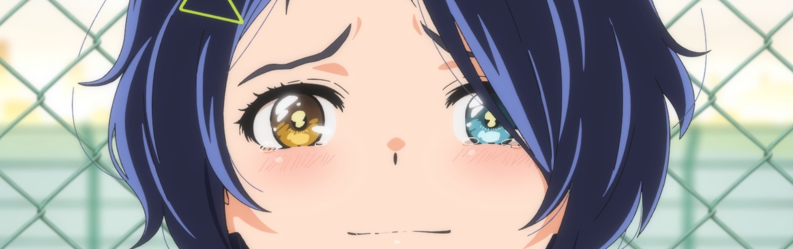
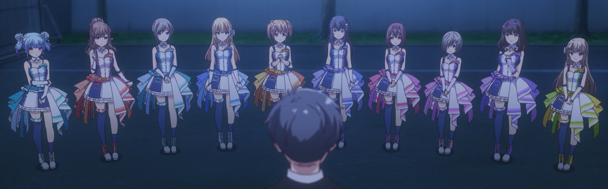
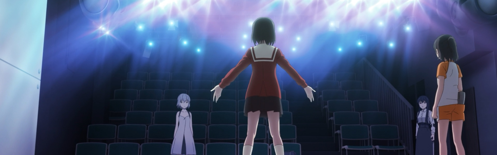

After taking a hiatus for 2020 (*woof*) wanted to get back to writing about the shows I'm going to be following (or try to follow) this season.

Winter 2021 is definitely the season of sequels, though I'm still not caught up with [*Attack on Titan*](https://anilist.co/anime/110277/Shingeki-no-Kyojin-The-Final-Season/) and [*Beastars 2*](https://anilist.co/anime/114194/BEASTARS-2/) will be in Netflix Jail for a while. I will probably watch [*Slime*](https://anilist.co/anime/108511/Tensei-Shitara-Slime-Datta-Ken-2nd-Season/) and [*Quintuplets*](https://anilist.co/anime/109261/5Toubun-no-Hanayome-/) but they are not quite a must watches for me.

### [Yakusoku no Neverland 2](https://anilist.co/anime/108725)

> The second season of &lt;i&gt;Yakusoku no Neverland&lt;/i&gt;.&lt;br&gt;&lt;br/&gt;&lt;br&gt;
Fifteen children escape Grace Field House, a false paradise, hoping for a chance at freedom. Instead, they encounter plants and animals they have never before seen, and are chased by demons. The outside world is so beautiful, and yet is almost too cruel to face.&lt;br&gt;&lt;br&gt;

Even so, the children refuse to give up. They are guided in their search for better lives only by a message from Minerva and a pen Norman left behind in order to fulfill their promise to return to the House to save those of their family who are still trapped within.&lt;/br&gt;&lt;br&gt;

(Source: Aniplex of America)
&lt;br&gt;&lt;br&gt;
&lt;i&gt;Note: Episode 1 streamed early on Amazon Prime on Jan 7, 2021. The regular TV broadcast started on Jan 8, 2021.&lt;/i&gt;

### [Re:Zero kara Hajimeru Isekai Seikatsu 2nd Season Part 2](https://anilist.co/anime/119661)

> The second cour of the second season of &lt;i&gt;Re:Zero kara Hajimeru Isekai Seikatsu&lt;/i&gt;.

### [Horimiya](https://anilist.co/anime/124080)

> A secret life is the one thing they have in common. At school, Hori is a prim and perfect social butterfly, but the truth is she&#x27;s a brash homebody. Meanwhile, under a gloomy facade, Miyamura hides a gentle heart, along with piercings and tattoos. In a chance meeting, they both reveal a side they&#x27;ve never shown. Could this blossom into something new?&lt;br&gt;&lt;br/&gt;&lt;br&gt;
(Source: Funimation)

### [Mushoku Tensei: Isekai Ittara Honki Dasu](https://anilist.co/anime/108465)

> When a 34-year-old underachiever gets run over by a bus, his story doesn’t end there. Reincarnated in a new world as an infant, Rudy will seize every opportunity to live the life he’s always wanted. Armed with new friends, some freshly acquired magical abilities, and the courage to do the things he’s always dreamed of, he’s embarking on an epic adventure—with all of his past experience intact!&lt;br&gt;&lt;br/&gt;&lt;br&gt;
(Source: Funimation)
&lt;br&gt;&lt;br&gt;
&lt;i&gt;Note: The anime pre-screened its 1st and 2nd episode starting on the 27th of December on the Nico Nico Live Broadcasting and D Anime Store services&lt;i/&gt;

### [Yuru Camp△ SEASON 2](https://anilist.co/anime/104459)

> The second season of &lt;i&gt;Yuru Camp△&lt;/i&gt;.

### [Tatoeba Last Dungeon Mae no Mura no Shounen ga Joban no Machi de Kurasu Youna Monogatari](https://anilist.co/anime/112649)

> The story follows Lloyd, a budding adventurer who just wants to get stronger. His plan? Head to the capital and discover his true power, even though he grew up being considered a weakling. So Lloyd heads out from his hometown, which interestingly exists directly next to the most dangerous dungeon. He might not think of himself as strong, but he’ll soon learn that there’s even more of a difference between him and other starting adventurers.&lt;br&gt;&lt;br/&gt;&lt;br&gt;
You know, because he grew up next to a deadly dungeon. He’s much stronger than he realizes.&lt;br&gt;
&lt;br&gt;
(Source: Funimation)

### [Ura Sekai Picnic](https://anilist.co/anime/116287)

> Moments from death, Sorawo is saved by the mysterious Toriko in the Otherside. Attracted to its beauty, she soon discovers that this dimension is inhabited by monsters once thought imaginary. Joining with Toriko in her search for a missing friend, they set out to explore this nightmare-realm and maybe make a little money. What they encounter could bring enlightenment—or drive them mad!&lt;br&gt;&lt;br/&gt;&lt;br&gt;
(Source: Funimation)

### [Wonder Egg Priority](https://anilist.co/anime/124845)

> This is the story of Ai, an introverted girl whose fate is forever changed when she acquires a mysterious “Wonder Egg” from a deserted arcade. That night, her dreams blend into reality, and as other girls obtain their own Wonder Eggs, Ai discovers new friends—and the magic within herself.&lt;br/&gt;&lt;br&gt;&lt;br&gt;
(Source: Funimation)

### [IDOLY PRIDE](https://anilist.co/anime/113814)

> After a successful audition, high school student Kotono Nagase and her best friend move into a dorm with eight other aspiring idols. They quickly realize it takes more than cute choreography and cute outfits to reach the top—it will take blood, sweat, and tears to advance in the idol-ranking VENUS program, where the top spot is held by superstar Mana Nagase…who happens to be Kotono’s older sister.&lt;br/&gt;&lt;br&gt;&lt;br&gt;(Source: Funimation)

### [Gekidol](https://anilist.co/anime/124131)

> Five years after a mystifying disaster decimates cities across the globe, Seria Morino receives an invitation from a mysterious woman to join Alice in Theater, a small stage troupe that takes it upon themselves to brighten the world through their performances using 3D hologram technology. As Seria settles in, she begins to uncover unexpected truths about herself and the world around her…&lt;br&gt;&lt;br/&gt;&lt;br&gt;
(Source: Funimation)

