### [Fumetsu no Anata e (To Your Eternity)](https://anilist.co/anime/114535)

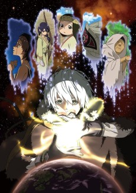

> A lonely boy wandering the Arctic regions of North America meets a wolf, and the two become fast friends, depending on each other to survive the harsh environment. But the boy has a history, and the wolf is more than meets the eye as well...&lt;br/&gt;&lt;br&gt;&lt;br&gt;
(Source: Kodansha USA)

### [Ijiranaide, Nagatoro-san (Don't Toy With Me, Miss Nagatoro)](https://anilist.co/anime/120697)

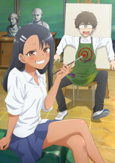

> Nagatoro is a freshman in high school who loves teasing and torturing her older male classmate! What’s her motivation and why does Senpai put up with her? Does Nagatoro just want to create misery for Senpai? Or maybe she secretly likes him?&lt;br/&gt;&lt;br&gt;&lt;br&gt;
(Source: Kodansha USA)

### [Tokyo Revengers](https://anilist.co/anime/120120)

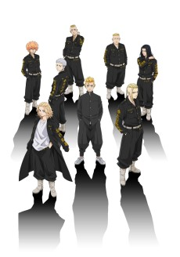

> Takemichi Hanagaki is a freelancer that&#x27;s reached the absolute pits of despair in his life. He finds out that the only girlfriend he ever had in his life that he dated in middle school, Hinata Tachibana, had been killed by the ruthless Tokyo Manji Gang. The day after hearing about her death, he&#x27;s standing on the station platform and ends up being pushed over onto the tracks by a herd of people. He closes his eyes thinking he&#x27;s about to die, but when he opens his eyes back up, he somehow had gone back in time 12 years. Now that he&#x27;s back living the best days of his life, Takemichi decides to get revenge on his life by saving his girlfriend and changing himself that he&#x27;d been running away from.&lt;br&gt;&lt;br/&gt;&lt;br&gt;
(Source: Crunchyroll)

### [Hige wo Soru. Soshite Joshikousei wo Hirou. (Higehiro: After Being Rejected, I Shaved and Took in a High School Runaway)](https://anilist.co/anime/114232)

> Yoshida was swiftly rejected by his crush of 5 years. On his way home after drinking his sorrows away, he saw a high school girl sitting on the street. &quot;I&#x27;ll let you do it with me, so let me stay&quot;. &quot;Don&#x27;t even joke about something like that&quot;. And so, the story of living with the high school girl Sayu began. The slice-of-life romance story between a runaway high school girl and a 26 year old salaryman ensues.

### [Zombie Land Saga: Revenge](https://anilist.co/anime/110733)

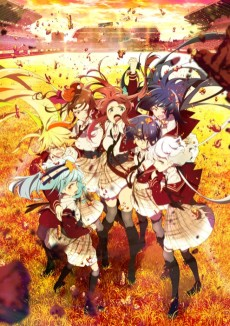

> The second season of &lt;i&gt;Zombie Land Saga&lt;/i&gt;.&lt;br&gt;&lt;br/&gt;&lt;br&gt;
From throughout the ages, a group of legendary girls have become zombie idols to save Saga Prefecture. It&#x27;s the return of the cutting-edge zombie idol anime! One day, Minamoto Sakura lost her life in an unfortunate accident. Then, ten years later… After Sakura wakes up in a strange mansion, mysterious idol producer Tatsumi Kotaro tells her that she will be joining a group of legendary girls to form an idol unit. The seven girls are charged with a quest to save the fading Saga Prefecture and adopt the group name Franchouchou. After overcoming the difficulties stemming from their different ages and different periods of history, their undead zombie bodies allow them to defy expectations of what idols can be. During the final winter of the Heisei era they performed their first featured concert at Karatsu&#x27;s Furusato Exhibition Hall, Arpino, taking another step towards becoming a legend. Now, in the modern Reiwa Era… The curtain rises on a new chapter in the story of Franchouchou, as they march towards a bright future full of hope.&lt;br&gt;
&lt;br&gt;
(Source: Crunchyroll)

### [Slime Taoshite 300-nen, Shiranai Uchi ni Level Max ni Nattemashita (I've Been Killing Slimes for 300 Years and Maxed Out My Level)](https://anilist.co/anime/112608)

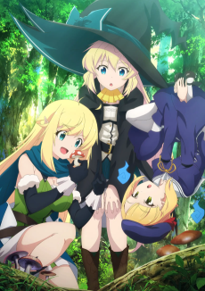

> An at-home comedy about a powerful girl who doesn’t work too hard!(⋈◍ ˃ᴗ˂ ◍)。✧♡ After dying of overwork in the real world, I’m reincarnated as an immortal witch, and I spend 300 years enjoying a relaxing life. At some point, though, I end up at level 99! All those years spent killing slimes to make the money to pay the bills gave me a ton of experience points… Rumors of the level 99 witch spread, and soon I’m up to my ears in curious adventurers, duelist dragons, and even a monster girl calling me her mom! “This isn’t a dojo, so don’t come here to fight me…!” I’ve never been on an adventure, but I’m the strongest in the world… What’s going to happen to my relaxing life?!&lt;br/&gt;&lt;br&gt;&lt;br&gt;
(Source: Crunchyroll)

### [Mairimashita! Iruma-kun 2](https://anilist.co/anime/116338)

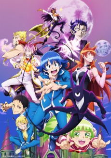

> The second season of &lt;i&gt;Mairimashita! Iruma-kun&lt;/i&gt;.&lt;br&gt;&lt;br/&gt;&lt;br&gt;
Suzuki Iruma, human and deeply non-aggressive, one day becomes the grandson of the great demon Sullivan. Doted on beyond belief, Iruma starts school where &quot;Grandpa&quot; serves as the chair... and finds, to his surprise, that he enjoys life there with Asmodeus, Clara, and the rest of his demon classmates. But just when Iruma thought he&#x27;d fitted in, there&#x27;s more trouble ahead! A ring begins to talk, and Iruma... goes bad?! Iruma&#x27;s chaotic, demonic life at school continues!&lt;br&gt;
&lt;br&gt;
(Source: NHK)

### [86: Eighty Six](https://anilist.co/anime/116589)

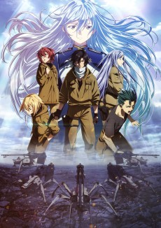

> A War Without Casualties:&lt;br&gt;&lt;br/&gt;&lt;br&gt;
The Republic of San Magnolia has long been under attack from the neighboring Giadian Empire&#x27;s army of unmanned drones known as the Legion. After years of painstaking research, the Republic finally developed autonomous drones of their own, turning the one-sided struggle into a war without casualties-or at least, that&#x27;s what the government claims.&lt;br&gt;
&lt;br&gt;
In truth, there is no such thing as a bloodless war. Beyond the fortified walls protecting the eighty-five Republic territories lies the &quot;nonexistent&quot; Eighty-Sixth Sector. The young men and women of this forsaken land are branded the Eighty-Six and, stripped of their humanity, pilot the &quot;unmanned&quot; weapons into battle...&lt;br&gt;
&lt;br&gt;
(Source: Yen Press)

### [Yuukoku no Moriarty Part 2 (Moriarty the Patriot Part 2)](https://anilist.co/anime/124858)

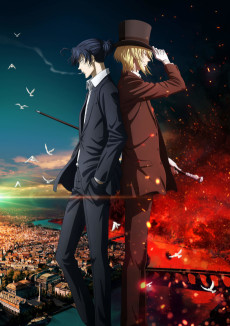

> The second cour of &lt;i&gt;Yuukoku no Moriarty&lt;/i&gt;.&lt;br&gt;&lt;br&gt;&lt;br/&gt;In the late 19th century, the British Empire nobility reigns while its working class suffers at their hands. Sympathetic to their plight, William James Moriarty wants to topple it all. Frustrated by the systemic inequity, Moriarty strategizes to fix the entire nation. Not even consulting detective Sherlock Holmes can stand in his way. It’s time for crime to revolutionize the world! The story continues in Part 2.&lt;br&gt;&lt;br&gt;
(Source: Funimation)&lt;br&gt;
&lt;br&gt;&lt;i&gt;Note: The anime received a special premiere on Funimation on March 28, 2021.&lt;/i&gt;

### [NOMAD: Megalo Box 2](https://anilist.co/anime/113359)

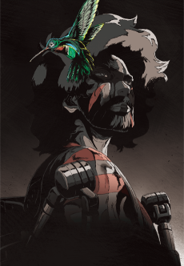

> The second season of &lt;i&gt;Megalo Box&lt;/i&gt;.&lt;br&gt;&lt;br/&gt;&lt;br&gt;
In the end, “Gearless” Joe was the one that reigned as the champion of Megalonia, a first ever megalobox tournament. Fans everywhere were mesmerized by the meteoric rise of Joe who sprung out from the deepest underground ring to the top in mere three months and without the use of gear. Seven years later, “Gearless” Joe was once again fighting in underground matches. Adorned with scars and once again donning his gear, but now known only as Nomad.&lt;br&gt;
&lt;br&gt;
(Source: TMS Entertainment)

### [Osananajimi ga Zettai ni Makenai Love Come (Osamake: Romcom Where The Childhood Friend Won't Lose)](https://anilist.co/anime/124675)

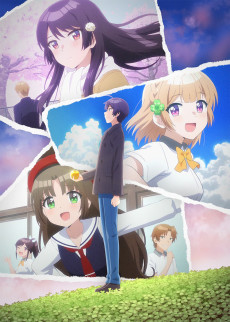

> My childhood friend Shida Kuroha seems to have feelings for me. She lives next door, and is small and cute. With an outgoing character, she’s the caring Onee-san type, this being one of her greatest strengths.&lt;br&gt;&lt;br/&gt;&lt;br&gt;
…But, I already have my first love, the beautiful idol of our school, and the award-winning author high school girl, Kachi Shirokusa! Thinking about it rationally, I should have no chances with her, but, while walking home from school, she only talks to me, with a smile even! I might actually have a chance, don’t you think?!&lt;br&gt;
&lt;br&gt;
Or so I thought, but then I heard that Shirokusa already has a boyfriend, and my life took a turn for the worse. I want to die. Why is it not me?! Even though she was my first love…As I was drowning in despair and depression, Kuroha whispered.&lt;br&gt;
&lt;br&gt;
—If it’s that tough for you, then how about we get revenge? The best revenge ever, that is~

### [Shadows House](https://anilist.co/anime/125038)

> In &lt;i&gt;SHADOWS HOUSE&lt;/i&gt;, a faceless clan lives in a large mansion, masquerading as nobles. Their caretakers are living dolls who spend their days cleaning up the dirt the tenants leave behind. But there’s a deeper mystery at play…and the secret of the house will be unveiled.&lt;br&gt;&lt;br&gt;(Source: Funimation)

### [Jouran: THE PRINCESS OF SNOW AND BLOOD](https://anilist.co/anime/129664)

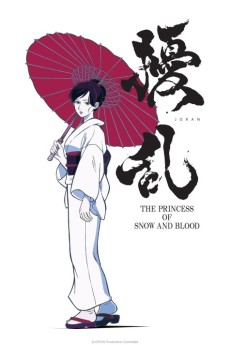

> The year is 1931. Prince Tokugawa Yoshinobu is 94 years old and holds absolute control over Japan. Remnants of the Meiji era’s culture can be seen around the city, but scientific technology and Japanese esoteric cosmology Onmyodo are also developing, exuding a sense of modernity. Yet lurking behind the glitz is Kuchinawa, a dissident group planning the assassination of the prince, and effectively the fall of the regime. Tasked to extinguish these dissidents is Nue, the government’s secret executioner group. Sawa Yukimura, who works for this organization, suffered from an early age at the hands of the Kuchinawa boss. Her entire family was murdered and she dedicated her life to avenging their death.&lt;br&gt;&lt;br/&gt;&lt;br&gt;
(Source: Crunchyroll)&lt;br&gt;&lt;br&gt;&lt;i&gt;Note: The show streamed the episodes on Hulu a week earlier than TV. The regular TV broadcast started on April 7, 2021.&lt;/i&gt;

### [Subarashiki Kono Sekai: The Animation (The World Ends With You: The Animation)](https://anilist.co/anime/120376)

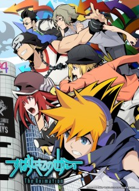

> Neku awakens in the middle of Shibuya&#x27;s bustling Scramble Crossing with no memory of how he got there. Little does he know, he&#x27;s been transported to an alternate plane of existence known as the Underground (UG). Now an unwilling participant in the mysterious &quot;Reapers&#x27; Game,&quot; Neku must partner up with a girl named Shiki in order to survive. Together, they complete missions and defeat monsters known as &quot;Noise&quot; as they gradually uncover the true nature of this twisted Game.&lt;br/&gt;&lt;br&gt;&lt;br&gt;
&quot;There&#x27;s only one way to stay alive in Shibuya: trust your partner.&quot; Will they survive the Reapers&#x27; Game?
&lt;br&gt;&lt;br&gt;
(Source: Official Site)

### [SSSS.DYNAZENON](https://anilist.co/anime/113950)

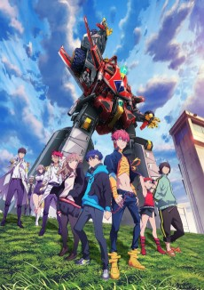

> One day, Yomogi Asanaka, a first-year student at Fujiyokidai High School, runs into a mysterious man named Gauma who claims to be a “kaiju user.”&lt;br&gt;&lt;br/&gt;&lt;br&gt;
The sudden appearance of a kaiju is followed by the entry of the gigantic robot, Dynazenon. In the wrong place at the wrong time are Yume Minami, Koyomi Yamanaka, and Chise Asukagawa, who are dragged into the fight against the kaiju.&lt;br&gt;
&lt;br&gt;
(Source: Funimation)

### [Vivy: Fluorite Eye’s Song (Vivy -Fluorite Eye's Song-)](https://anilist.co/anime/128546)

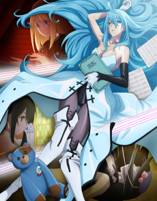

> An AI named Matsumoto appears before Vivy, the world’s first autonomous humanoid AI. Matsumoto’s mission is to rewrite history together with Vivy, in order to stop the war between AI and humans that will happen one century later.&lt;br&gt;&lt;br/&gt;&lt;br&gt;
(Source: Funimation)

### [Mashiro no Oto (Those Snow White Notes)](https://anilist.co/anime/122348)

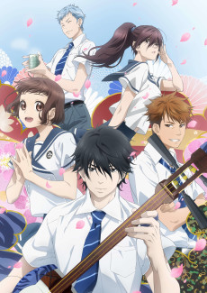

> Sawamura Matsugorou is a shamisen player of legendary talent. Upon his death, his grandson, Sawamura Setsu, lost his ability to play. Having lost his beloved sound, Setsu finds himself in Tokyo in search of a new sound to love. Tachiki Yuna, who works at a club, hooks him up with a gig to play there as a warm up act. Setsu imbues the sound of his shamisen with his many thoughts and feelings he has of others, still searching for his own sound and his own feelings.&lt;br&gt;&lt;br/&gt;&lt;br&gt;
(Source: Crunchyroll)

### [Sayonara Watashi no Cramer (Farewell, My Dear Cramer)](https://anilist.co/anime/123494)

> With no soccer accomplishments to speak of during the entirety of Sumire Suo’s junior high school years, the young wing gets an odd offer. Suo’s main rival, Midori Soshizaki, invites her to join up on the same team in high school, with a promise that she’ll never let Suo “play alone.” It’s an earnest offer, but the question is whether Suo will take her up on it. Thus the curtain opens on a story that collects an enormous cast of individual soccer-playing personalities!&lt;br/&gt;&lt;br&gt;&lt;br&gt;
(Source: Kodansha USA)

### [Super Cub](https://anilist.co/anime/113418)

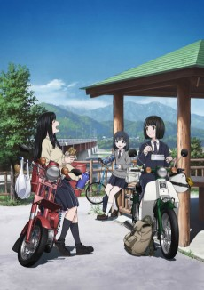

> The story centers on Koguma, a high school girl in Yamanashi. She has no parents, friends, or hobbies, and her daily life is empty. One day, Koguma gets a used Honda Super Cub motorcycle. This is her first time going to school on a motorcycle. Running out of gas and hitting detours become a small source of adventure in Koguma&#x27;s life. She is satisfied with this strange transformation, but her classmate Reiko ends up talking to her about how she also goes to school by motorcycle. One Super Cub begins to open up a lonely girl&#x27;s world, introducing her to a new everyday life and friendship.&lt;br&gt;&lt;br&gt;(Source: Anime News Network)

### [Dragon, Ie wo Kau. (Dragon Goes House-Hunting)](https://anilist.co/anime/112376)

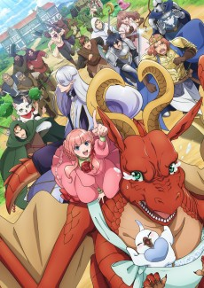

> The story follows Letty, a dragon who is cast out of their family home after failing to live up to some dangerously high standards (talk about relatable) and sets out to find a new place to live.&lt;br&gt;&lt;br/&gt;&lt;br&gt;
But in this world full of magical creatures, elves, dwarves and more, it’s not so easy for a fearsome dragon. Get ready for the high-stress world of real estate to collide with this comedy adventure.&lt;br&gt;
&lt;br&gt;
(Source: Funimation)

### [Yakunara Mug Cup Mo (Let's Make a Mug Too)](https://anilist.co/anime/122148)

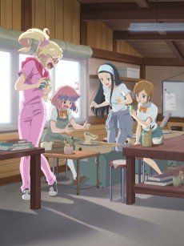

> The city of Tajimi, located in the southern part of Gifu Prefecture, Japan, is famous for Mino earthenware. The city is dotted with historical pottery producers and ceramic art museums. It has facilities where you can try your hand at making pottery, and many restaurants that serve food on Minoware dishes.&lt;br/&gt;&lt;br&gt;&lt;br&gt;
The story begins when a high school girl moves to a shopping street in Tajimi. Many encounters await her, friends, town folk, ceramic art, etc. What will she discover in a town famous for ceramic?&lt;br&gt;&lt;br&gt;(Source: Official Website)

### [BLUE REFLECTION RAY](https://anilist.co/anime/129814)

> Set in a world where feelings such as joy, sadness, and anger have an unseen influence on reality, the story follows the fateful meeting of Hiori Hirahara, an outgoing girl who always reaches out to people in need, and Ruka Hanari, a socially awkward girl who doesn&#x27;t know how to get along well with other people. Will their feelings change themselves and the world around them? &lt;br&gt;&lt;br/&gt;&lt;br&gt;
(Source: Crunchyroll)

