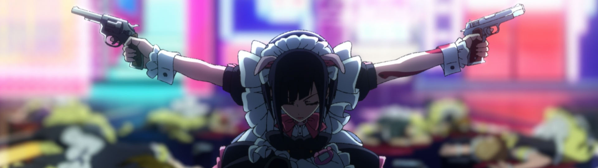

### [Cyberpunk: Edgerunners](https://anilist.co/anime/120377)

With the botched release of *Cyberpunk: 2077*, I've been holding off on the game until [CD Projekt Red](https://www.cdprojektred.com/en/) had a chance to fix up the game. I didn't pick up *The Witcher 3* until all three expansions were released and the game was really polished. The anime changed my mind.

*Trigger* went **ALL** out with this production and I love every bit of it.

### [Chainsaw Man (Chainsaw Man)](https://anilist.co/anime/127230)

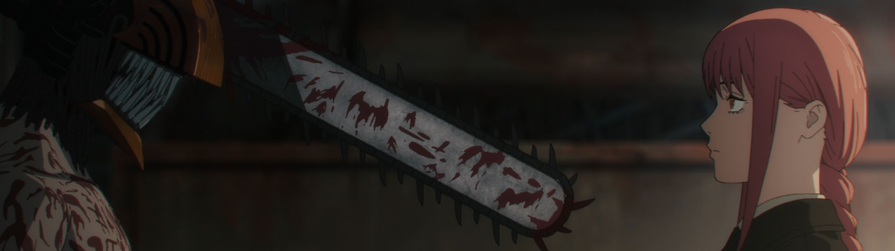

> Denji is a teenage boy living with a Chainsaw Devil named Pochita. Due to the debt his father left behind, he has been living a rock-bottom life while repaying his debt by harvesting devil corpses with Pochita.&lt;br&gt;&lt;br&gt;&lt;br/&gt;One day, Denji is betrayed and killed. As his consciousness fades, he makes a contract with Pochita and gets revived as &quot;Chainsaw Man&quot; — a man with a devil&#x27;s heart.&lt;br&gt;
&lt;br&gt;
(Source: Crunchyroll)

### [SPY×FAMILY Part 2 (SPY x FAMILY Cour 2)](https://anilist.co/anime/142838)

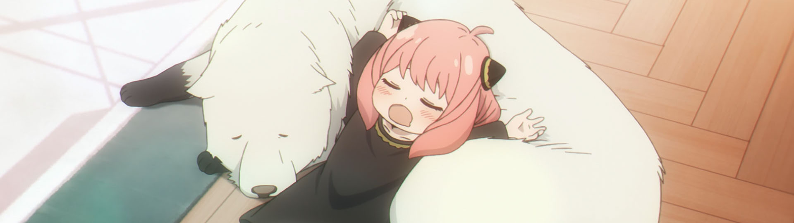

> The second half of &lt;i&gt;SPYxFAMILY&lt;/i&gt;.

### [Mob Psycho 100 III (Mob Psycho 100 III)](https://anilist.co/anime/140439)

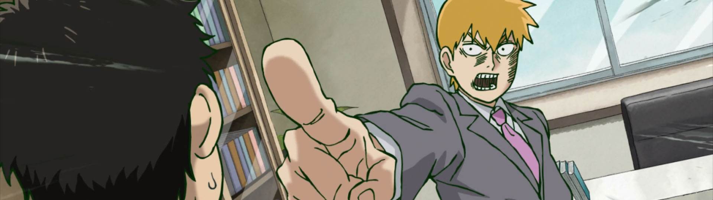

> The third season of &lt;i&gt;Mob Psycho 100&lt;/i&gt;. &lt;br&gt;&lt;br&gt;&lt;br/&gt;The appearance of a divine tree and new religion turns Mob and Reigen&#x27;s city upside down!&lt;br&gt;&lt;br&gt;
(Source: Crunchyroll)

### [Uzaki-chan wa Asobitai! ω (Uzaki-chan Wants to Hang Out! Season 2)](https://anilist.co/anime/124395)

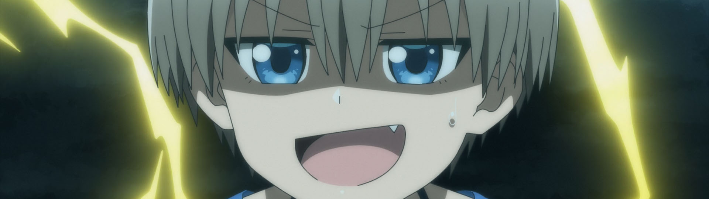

> The second season of &lt;i&gt;Uzaki-chan wa Asobitai!&lt;/i&gt;.

### [Bocchi the Rock! (BOCCHI THE ROCK!)](https://anilist.co/anime/130003)

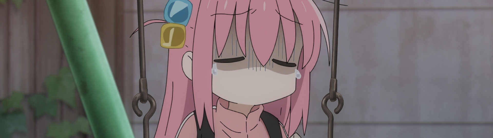

`I feel seen` the animation...

There is so much to like about this show -- I can't recommend it highly enough.

### [Do It Yourself!! (Do It Yourself!!)](https://anilist.co/anime/131516)

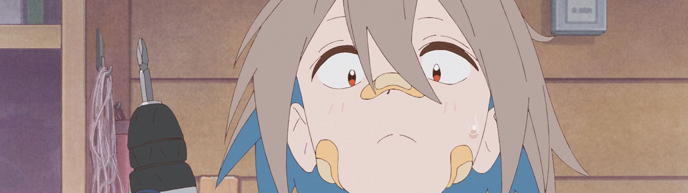

> Building furniture and friendships have a lot in common. Intention, effort, and hard work are needed for both crafts. This is a story of girls in a DIY club building both as they carve out their futures. None of it comes easy, but that doesn’t stop any of ’em. Furniture, friendships, and the future—they’re building it all with their own hands! &lt;br&gt;&lt;br/&gt;&lt;br&gt;
(Source: Crunchyroll)

### [Akiba Meido Sensou (Akiba Maid War)](https://anilist.co/anime/151379)

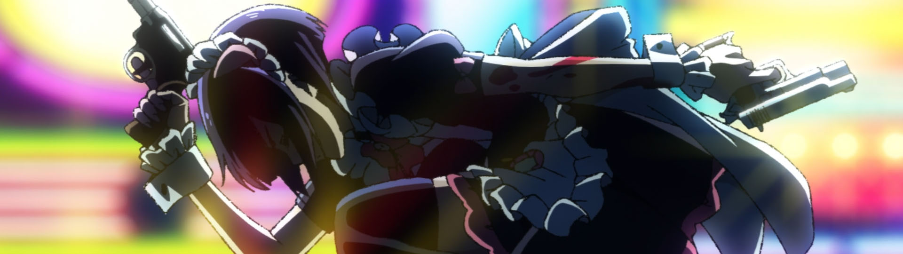

With all the hard hitting shows of this season, this one might unfortunately fly under a lot of people's radar -- It has AOTS potential! Don't sleep on this one.

Go into it cold.  Don't read up on it. Enjoy the ride in all it's glory!

### [Kidou Senshi Gundam: Suisei no Majo (Mobile Suit Gundam: The Witch from Mercury)](https://anilist.co/anime/139274)

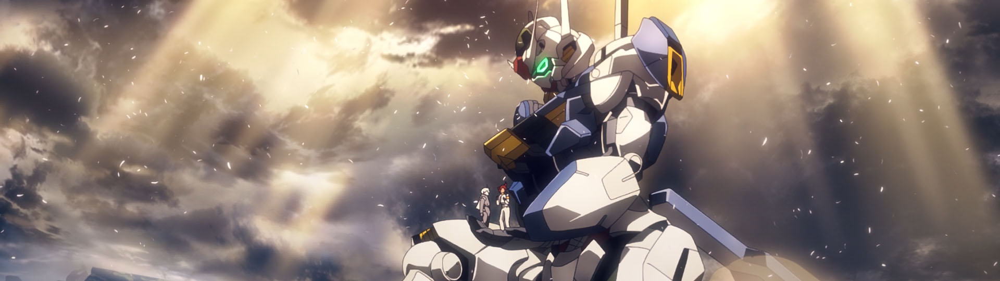

The show I didn't have on my radar whatsoever.

### [Koukyuu no Karasu (Raven of the Inner Palace)](https://anilist.co/anime/142701)

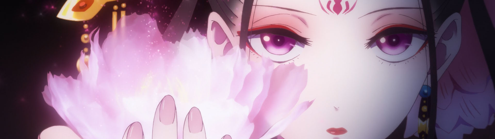

> Deep within the inner palace lives a special consort who does not serve the emperor despite her position as a consort. She is known as the Raven Consort. People who have seen her say she looks like an old woman, while others say she looks like a young girl. Stories tell of her use of mysterious arts, and how she can take on any request, be it death curses or finding lost things. Koushun, the current emperor, goes to visit the Raven Consort with that intention. Without knowing that their fated meeting will become a taboo that will overturn history.&lt;br/&gt;&lt;br&gt;&lt;br&gt;
(Source: Shikkarito)

### [Yama no Susume: Next Summit (Encouragement of Climb: Next Summit)](https://anilist.co/anime/131182)

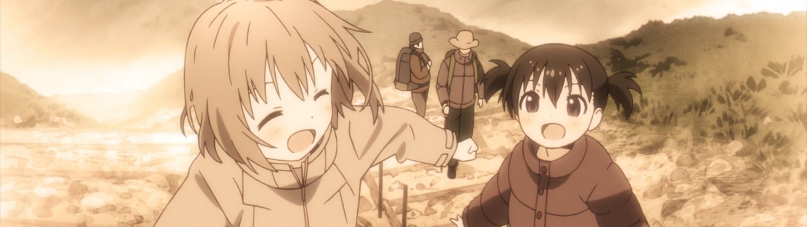

I was hoping for something close to [Yuru Camp](https://anilist.co/anime/98444) but unfortunately the severely rushed opening episode was definitely a let down from those expectations. Instead of introducing each of the girls in their own episode, *everything* is crammed into the first half of episode 1, inducing whiplash as characters are suddenly friends after  a single line of dialog.

I'll give the next few episodes a shot but my expectations were definitely too high for this one.

