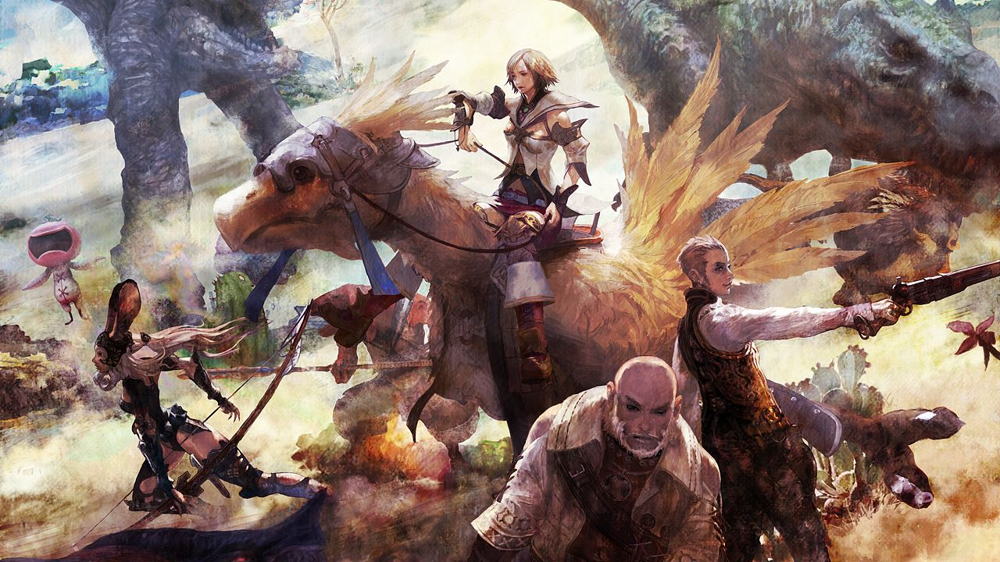

With *Final Fantasy XII - The Zodiac Age* being released on the Switch, I realized that I never finished it on the PS2 (wow that was a long time ago). I think this will be a very good game to commute with.

I'm holding off replaying *FFVII* in light of the *Remake* announcement -- I'm excited to play that again as I really don't remember much about the story other than high level bits and pieces.
