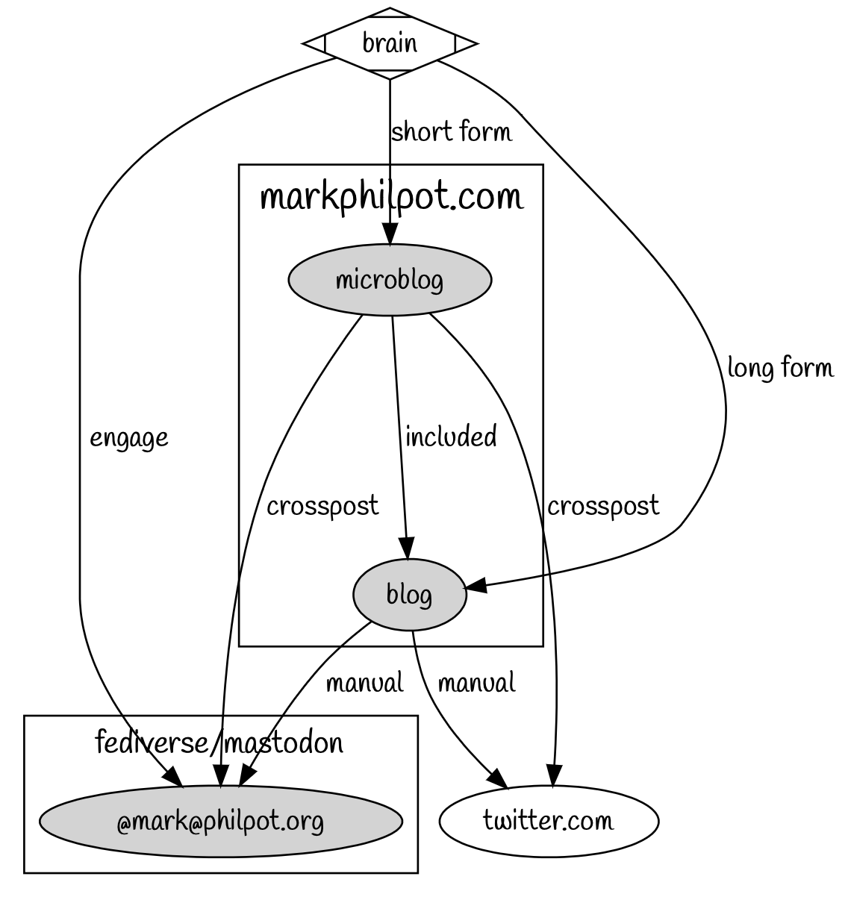
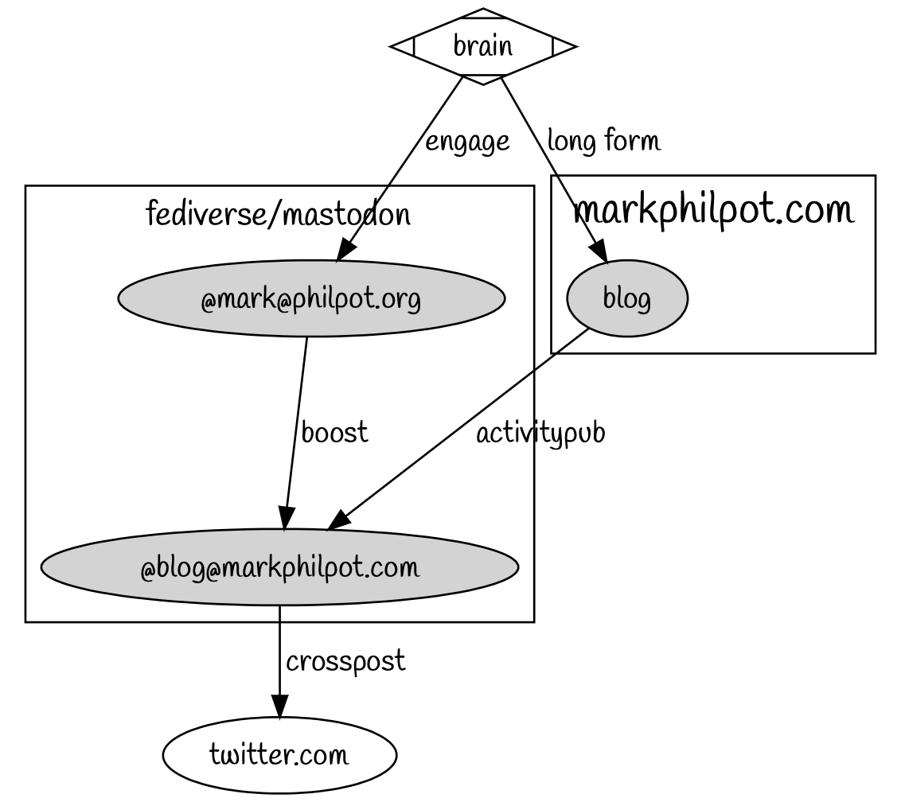

# Federation Project
#digitalGarden

## Existing

## Target

## Tasks
- [ ] Add activity pub support to markphilpot.com
	- [ ] https://lewisdale.dev/post/you-can-be-friends-with-my-blog/
	- [ ] https://blog.joinmastodon.org/2018/06/how-to-implement-a-basic-activitypub-server/
	- [ ] https://blog.joinmastodon.org/2018/07/how-to-make-friends-and-verify-requests/
- [ ] Export posts from https://micro.blog
- [ ] Setup https://moa.party to cross post `@blog@markphilpot.com` activity to twitter