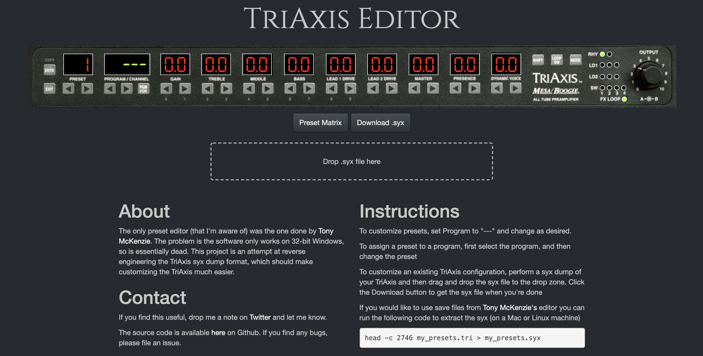
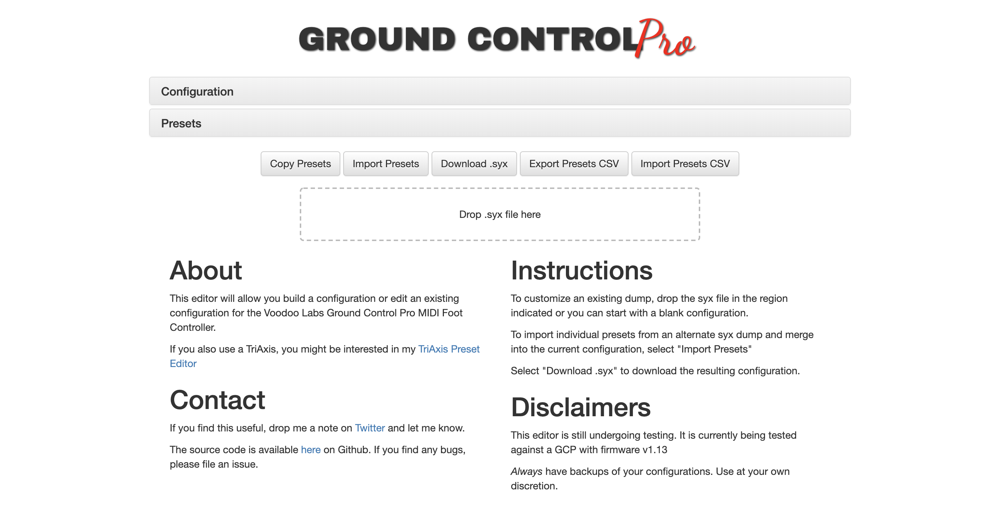

## TriAxis &amp; Ground Control Pro Web Apps

[triaxiseditor.com](https://triaxiseditor.com)

[gcproeditor.com](http://gcproeditor.com)

## DaedaFusion OSS

[DaedaFusion Github](https://github.com/daedafusion)

## anilime

Manage your AniList anime & manga on iOS

## Own Goals Podcast

Discussing various topics with [Chris Biscardi](https://twitter.com/chrisbiscardi) around software development, hardware, and games while trying very hard not to screw things up too badly.
